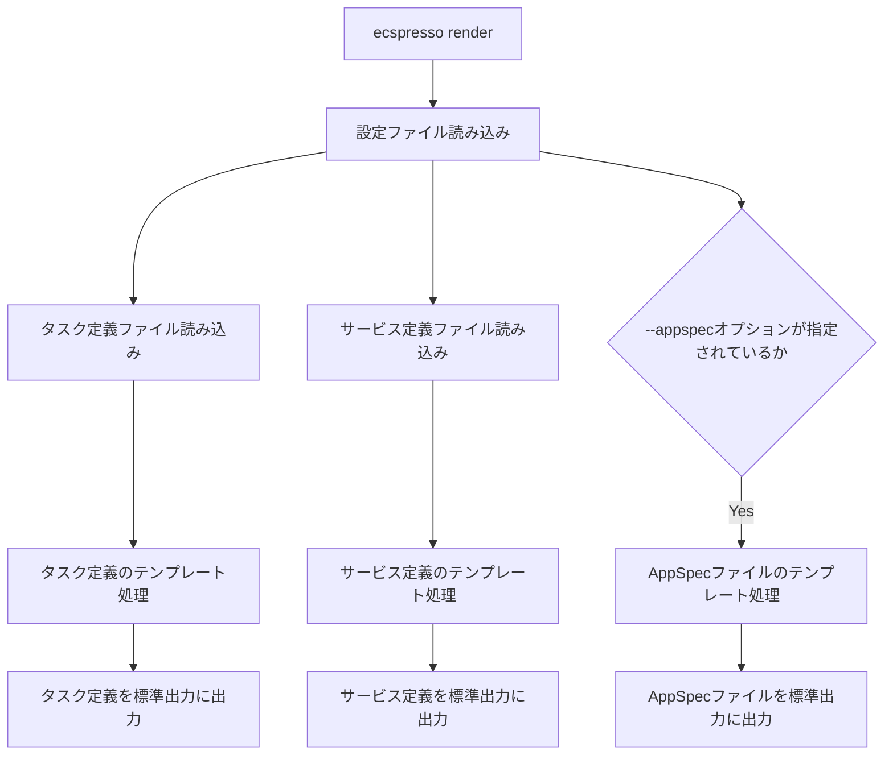

# render

`render`コマンドは、設定、サービス定義、タスク定義ファイルを標準出力にレンダリングします。

## 基本的な使い方

```bash
ecspresso render --config CONFIG_FILE
```

## オプション

| オプション | 説明 | デフォルト値 |
|------------|------|-------------|
| `--config` | 設定ファイルのパス | `ecspresso.yml` |
| `--task-definition` | タスク定義ファイルのパス | 設定ファイルで指定されたパス |
| `--service-definition` | サービス定義ファイルのパス | 設定ファイルで指定されたパス |
| `--appspec` | AppSpecファイルをレンダリングするかどうか | `false` |
| `--output` | 出力形式（json, yaml） | `json` |

## 詳細

`render`コマンドは、以下のファイルをテンプレート処理して標準出力にレンダリングします：

1. 設定ファイル
2. タスク定義ファイル
3. サービス定義ファイル
4. AppSpecファイル（`--appspec`オプションが指定されている場合）

このコマンドは、テンプレート処理の結果を確認するのに役立ちます。

## レンダリングフロー



## 使用例

### 基本的な使用例

```bash
ecspresso render --config ecspresso.yml
```

### AppSpecファイルをレンダリングする例

```bash
ecspresso render --config ecspresso.yml --appspec
```

### YAML形式で出力する例

```bash
ecspresso render --config ecspresso.yml --output yaml
```

### 特定のタスク定義ファイルをレンダリングする例

```bash
ecspresso render --config ecspresso.yml --task-definition my-task-def.json
```

### 特定のサービス定義ファイルをレンダリングする例

```bash
ecspresso render --config ecspresso.yml --service-definition my-service-def.json
```

## テンプレート機能

ecspressoのテンプレート機能は、Go言語のテンプレートエンジンを使用しています。以下のような機能を提供しています：

1. 環境変数の展開
2. 条件分岐
3. ループ処理
4. 関数の使用

### 環境変数の展開

```json
{
  "containerDefinitions": [
    {
      "name": "app",
      "image": "nginx:{{ must_env `IMAGE_TAG` }}",
      "essential": true
    }
  ]
}
```

### 条件分岐

```json
{
  "containerDefinitions": [
    {
      "name": "app",
      "image": "nginx:latest",
      "essential": true,
      "environment": [
        {
          "name": "DEBUG",
          "value": "{{ if env `DEBUG` }}true{{ else }}false{{ end }}"
        }
      ]
    }
  ]
}
```

### ループ処理

```json
{
  "containerDefinitions": [
    {
      "name": "app",
      "image": "nginx:latest",
      "essential": true,
      "environment": [
        {{ range $i, $e := env_json `ENVIRONMENT_VARS` }}
        {{ if $i }},{{ end }}
        {
          "name": "{{ $e.name }}",
          "value": "{{ $e.value }}"
        }
        {{ end }}
      ]
    }
  ]
}
```

### 関数の使用

```json
{
  "containerDefinitions": [
    {
      "name": "app",
      "image": "nginx:latest",
      "essential": true,
      "environment": [
        {
          "name": "TIMESTAMP",
          "value": "{{ timestamp }}"
        }
      ]
    }
  ]
}
```

## 利用可能な関数

ecspressoのテンプレート機能では、以下の関数が利用可能です：

- `env` - 環境変数の値を取得（存在しない場合は空文字列）
- `must_env` - 環境変数の値を取得（存在しない場合はエラー）
- `env_json` - 環境変数の値をJSONとしてパース
- `timestamp` - 現在のタイムスタンプを取得
- `tfstate` - Terraformの状態ファイルから値を取得
- `ssm` - AWS Systems Managerのパラメータストアから値を取得
- `ssm_json` - AWS Systems Managerのパラメータストアから値をJSONとしてパース
