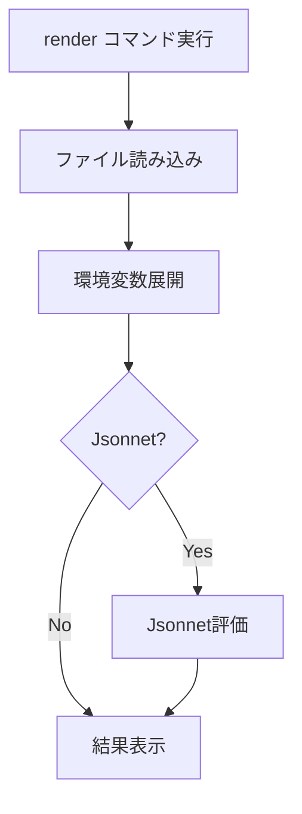

# render

`render`コマンドは、タスク定義やサービス定義ファイルをレンダリングして標準出力に表示します。Jsonnetテンプレートを使用している場合や、環境変数の展開結果を確認したい場合に役立ちます。

## 基本的な使い方

```bash
ecspresso render
```

## オプション

| オプション | 説明 | デフォルト値 |
|------------|------|------------|
| `--task-def` | レンダリングするタスク定義ファイル | 設定ファイルの`task_definition` |
| `--service-def` | レンダリングするサービス定義ファイル | 設定ファイルの`service_definition` |
| `--config` | レンダリングする設定ファイル | `ecspresso.yml` |

## レンダリングプロセス

`render`コマンドは以下のステップを実行します：

1. 指定されたファイルを読み込み
2. 環境変数を展開
3. Jsonnetの場合は評価
4. 結果を標準出力に表示



## 使用例

### 基本的な使用方法

```bash
ecspresso render
```

### タスク定義のみをレンダリング

```bash
ecspresso render --task-def
```

### サービス定義のみをレンダリング

```bash
ecspresso render --service-def
```

### 設定ファイルをレンダリング

```bash
ecspresso render --config
```

### 特定のファイルをレンダリング

```bash
ecspresso render --task-def=custom-task-def.jsonnet
```

## 環境変数の展開

`render`コマンドは、ファイル内の環境変数参照（`${VARIABLE}`形式）を展開します。これにより、異なる環境で同じテンプレートを使用する際に、環境変数の展開結果を確認できます。

```bash
# 環境変数を設定
export ENVIRONMENT=production
export IMAGE_TAG=v1.2.3

# レンダリング結果を確認
ecspresso render --task-def
```

## Jsonnetテンプレートの評価

Jsonnetテンプレートを使用している場合、`render`コマンドはテンプレートを評価して結果のJSONを表示します。

```bash
# Jsonnetテンプレートをレンダリング
ecspresso render --task-def=task-def.jsonnet
```

## ファイルへの出力

標準出力をリダイレクトすることで、レンダリング結果をファイルに保存できます：

```bash
ecspresso render --task-def > rendered-task-def.json
```

## 注意事項

- 指定したファイルが存在しない場合は、エラーが発生します。
- Jsonnetテンプレートを使用している場合、Jsonnetの構文エラーがあるとエラーが発生します。
- 環境変数が設定されていない場合、`${VARIABLE}`はそのまま残ります。
