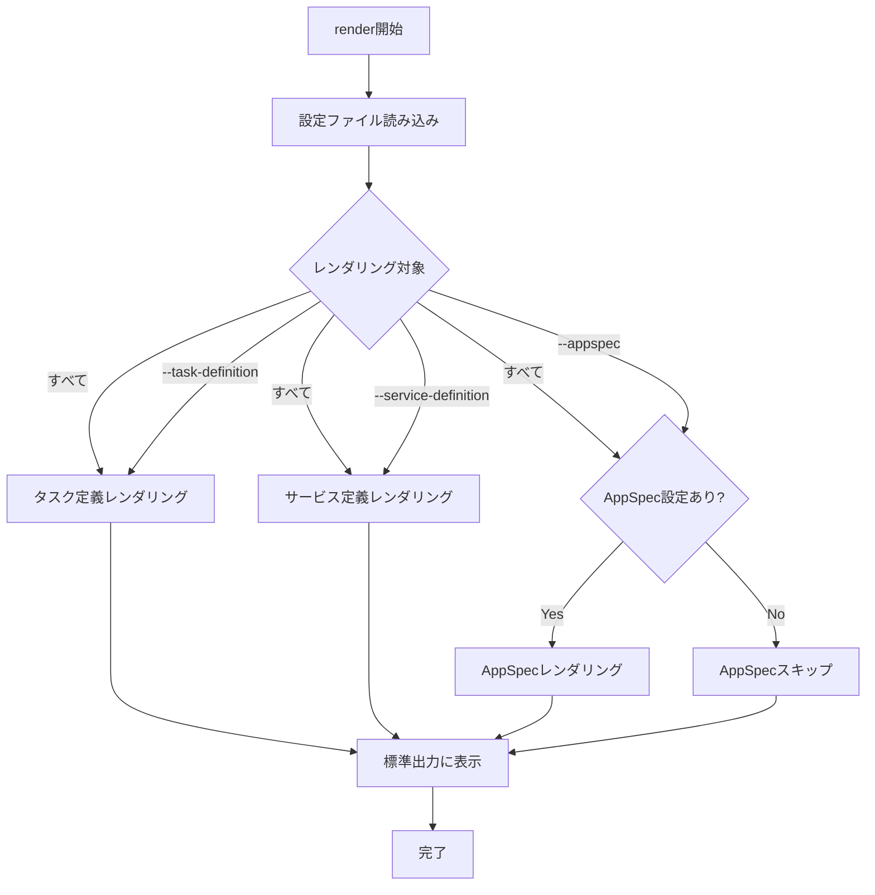

# render

`render`コマンドは、タスク定義とサービス定義のテンプレートをレンダリングし、その結果を標準出力に表示します。テンプレート変数や関数が適用された後の最終的な設定ファイルを確認するのに役立ちます。

## 基本的な使い方

```console
$ ecspresso render --config ecspresso.yml
```

## オプション

| オプション | 説明 | デフォルト値 |
|------------|------|-------------|
| `--config FILE` | 設定ファイルのパス | `ecspresso.yml` |
| `--task-definition` | タスク定義のみをレンダリング | `false` |
| `--service-definition` | サービス定義のみをレンダリング | `false` |
| `--appspec` | AppSpecファイルのみをレンダリング | `false` |

## 使用例

### すべての定義ファイルをレンダリング

```console
$ ecspresso render --config ecspresso.yml
```

### タスク定義のみをレンダリング

```console
$ ecspresso render --config ecspresso.yml --task-definition
```

### サービス定義のみをレンダリング

```console
$ ecspresso render --config ecspresso.yml --service-definition
```

### AppSpecファイルのみをレンダリング（CodeDeployを使用する場合）

```console
$ ecspresso render --config ecspresso.yml --appspec
```

## レンダリングフロー

`render`コマンドの実行フローは以下の通りです：



## テンプレート機能

`render`コマンドは、設定ファイル内のテンプレート変数や関数を評価します。以下のようなテンプレート機能がサポートされています：

### 環境変数の参照

```json
{
  "name": "{{ env `SERVICE_NAME` }}"
}
```

### 外部コマンドの実行結果の参照

```json
{
  "image": "{{ must_env `ECR_REPOSITORY` }}:{{ must_env `IMAGE_TAG` }}"
}
```

### AWS Systems Manager パラメータストアの値の参照

```json
{
  "value": "{{ ssm `/path/to/parameter` }}"
}
```

### CloudFormation出力値の参照

```json
{
  "subnet": "{{ cfn_output `StackName` `OutputKey` }}"
}
```

## 注意事項

- `render`コマンドは実際のデプロイを行わず、設定ファイルの内容を表示するだけです
- テンプレート変数や関数が正しく評価されない場合、エラーが表示されます
- 環境変数が見つからない場合、`env`関数は空文字列を返しますが、`must_env`関数はエラーを発生させます
- レンダリング結果は、実際にAWSに送信される内容と同じです
