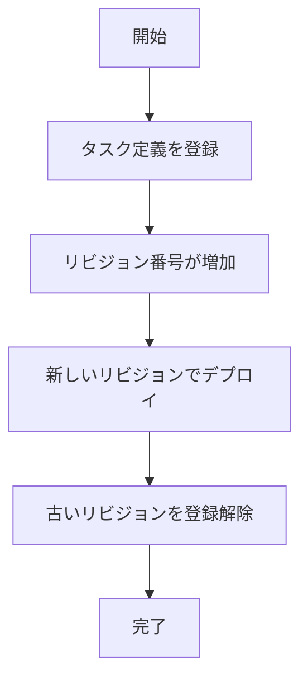

# revisions

`revisions`コマンドは、タスク定義のリビジョンを一覧表示するためのコマンドです。タスク定義の履歴を確認したり、特定のリビジョンを参照したりする場合に使用します。

## 基本的な使い方

```console
$ ecspresso revisions [オプション]
```

## オプション

| オプション | 説明 | デフォルト値 |
|------------|------|------------|
| `--config` | 設定ファイルのパス | `ecspresso.yml` |
| `--output` | 出力形式（`json`または`tsv`） | - |

## 出力例

```
1
2
3
4
5
```

JSON形式の出力例：

```json
[
  1,
  2,
  3,
  4,
  5
]
```

## 使用例

### 基本的な使用方法

```console
$ ecspresso revisions --config ecspresso.yml
```

### JSON形式で出力

```console
$ ecspresso revisions --config ecspresso.yml --output json
```

### TSV形式で出力

```console
$ ecspresso revisions --config ecspresso.yml --output tsv
```

### 最新のリビジョンを取得

```console
$ ecspresso revisions --config ecspresso.yml | sort -n | tail -1
```

### 特定のリビジョンを使用してデプロイ

```console
$ REVISION=$(ecspresso revisions --config ecspresso.yml | sort -n | tail -1)
$ ecspresso deploy --config ecspresso.yml --revision $REVISION
```

## タスク定義のリビジョン管理

ECSでは、タスク定義のリビジョンが自動的に管理されます。新しいタスク定義を登録するたびに、リビジョン番号が増加します。古いリビジョンは自動的には削除されないため、不要になったリビジョンは`deregister`コマンドで登録解除することをお勧めします。



## リビジョンのクリーンアップ

タスク定義のリビジョンが増えすぎると、管理が難しくなります。以下のスクリプトを使用して、最新の5つを除くすべてのリビジョンを登録解除することができます。

```bash
#!/bin/bash
# cleanup-revisions.sh
set -e

# 最新の5つを除くすべてのリビジョンを登録解除
REVISIONS=$(ecspresso revisions --config ecspresso.yml | sort -n | head -n -5)
for REV in $REVISIONS; do
  echo "Deregistering revision $REV..."
  ecspresso deregister --config ecspresso.yml --revision $REV
done
```

## CI/CDパイプラインでの使用

`revisions`コマンドは、CI/CDパイプラインでタスク定義のリビジョンを管理するのに役立ちます。以下は、GitHub Actionsでの使用例です：

```yaml
jobs:
  cleanup:
    runs-on: ubuntu-latest
    steps:
      - uses: actions/checkout@v3
      - uses: kayac/ecspresso@v2
        with:
          version: v2.3.0
      - run: |
          # 最新の5つを除くすべてのリビジョンを登録解除
          REVISIONS=$(ecspresso revisions --config ecspresso.yml | sort -n | head -n -5)
          for REV in $REVISIONS; do
            ecspresso deregister --config ecspresso.yml --revision $REV
          done
```

## 特定のリビジョンのタスク定義を表示

特定のリビジョンのタスク定義を表示するには、`revisions`コマンドと`aws ecs describe-task-definition`コマンドを組み合わせて使用します。

```bash
#!/bin/bash
# show-revision.sh
set -e

REVISION=$1
FAMILY=$(grep "family:" ecs-task-def.json | awk '{print $2}' | tr -d '",' | tr -d ' ')

if [ -z "$REVISION" ]; then
  echo "Usage: $0 <revision>"
  exit 1
fi

aws ecs describe-task-definition --task-definition $FAMILY:$REVISION
```

## 注意事項

- `revisions`コマンドは、タスク定義のリビジョン番号のみを表示します
- タスク定義の詳細情報を表示するには、`aws ecs describe-task-definition`コマンドを使用してください
- リビジョン番号は1から始まり、新しいタスク定義を登録するたびに増加します
- 古いリビジョンは自動的には削除されないため、定期的にクリーンアップすることをお勧めします
- `--output`オプションを使用すると、出力形式を変更できます
- `revisions`コマンドは、設定ファイルからタスク定義のファミリー名を取得します

## 関連コマンド

- [register](./register.html) - タスク定義を登録
- [deregister](./deregister.html) - タスク定義の登録を解除
- [deploy](./deploy.html) - サービスをデプロイ
- [rollback](./rollback.html) - 以前のタスク定義にロールバック
