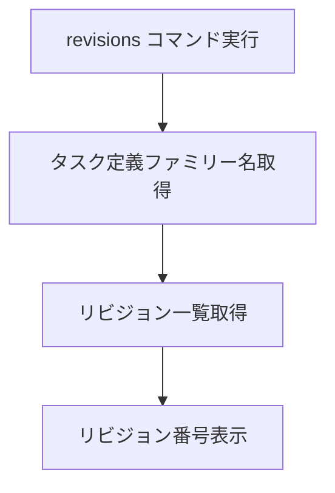

# revisions

`revisions`コマンドは、ECSタスク定義のリビジョン一覧を表示します。タスク定義の履歴を確認したり、ロールバック先のリビジョンを選択したりする際に役立ちます。

## 基本的な使い方

```bash
ecspresso revisions
```

## オプション

| オプション | 説明 | デフォルト値 |
|------------|------|------------|
| `--family` | タスク定義ファミリー名 | 設定ファイルから取得 |
| `--max-items` | 表示するリビジョンの最大数 | `100` |

## 出力形式

`revisions`コマンドは、タスク定義のリビジョン番号を新しい順に表示します。

```
3
2
1
```

## リビジョン一覧の取得プロセス



## 使用例

### 基本的な使用方法

```bash
ecspresso revisions
```

### 特定のタスク定義ファミリーのリビジョン一覧を表示

```bash
ecspresso revisions --family=your-task-definition
```

### 表示するリビジョン数を制限

```bash
ecspresso revisions --max-items=10
```

## シェルスクリプトとの組み合わせ

`revisions`コマンドは、シェルスクリプトと組み合わせて使用することで、より高度な操作が可能です。

### 最新のリビジョンを取得

```bash
LATEST_REVISION=$(ecspresso revisions | head -n 1)
echo "Latest revision: $LATEST_REVISION"
```

### 特定のリビジョン以外をすべて登録解除

```bash
# 最新の5つのリビジョンを除くすべてのリビジョンを登録解除
for rev in $(ecspresso revisions | tail -n +6); do
  ecspresso deregister --revision=$rev --force
done
```

### 特定の範囲のリビジョンを登録解除

```bash
# リビジョン10から20までを登録解除
for rev in $(ecspresso revisions | grep -E '^(1[0-9]|20)$'); do
  ecspresso deregister --revision=$rev --force
done
```

## 注意事項

- タスク定義ファミリーが存在しない場合は、エラーが発生します。
- `--max-items`オプションの最大値は100です。より多くのリビジョンを表示する場合は、複数回コマンドを実行する必要があります。
