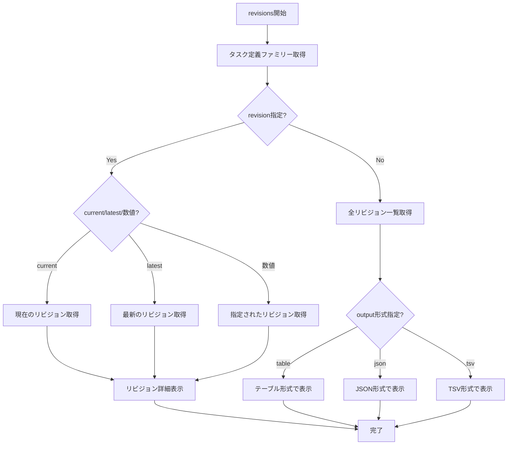

# revisions

`revisions`コマンドは、タスク定義のリビジョン一覧を表示するために使用します。特定のリビジョンの詳細情報も表示できます。

## 基本的な使い方

```console
$ ecspresso revisions --config ecspresso.yml
```

## オプション

|| オプション | 説明 | デフォルト値 |
|------------|------|-------------|
|| `--revision` | リビジョン番号または'current'または'latest' | `""` |
|| `--output` | 出力形式（`json`、`table`、`tsv`） | `table` |

## 使用例

### すべてのリビジョンをテーブル形式で表示

```console
$ ecspresso revisions --config ecspresso.yml
```

### 特定のリビジョンの詳細を表示

```console
$ ecspresso revisions --config ecspresso.yml --revision 3
```

### 現在使用中のリビジョンの詳細を表示

```console
$ ecspresso revisions --config ecspresso.yml --revision current
```

### 最新のリビジョンの詳細を表示

```console
$ ecspresso revisions --config ecspresso.yml --revision latest
```

### JSON形式で出力

```console
$ ecspresso revisions --config ecspresso.yml --output json
```

### TSV形式で出力

```console
$ ecspresso revisions --config ecspresso.yml --output tsv
```

## リビジョン一覧表示フロー



## 出力例（テーブル形式）

```
+--------+------------------+----------------------------------+-------------+
| ACTIVE |    REVISION      |             IMAGE                |  REGISTERED |
+--------+------------------+----------------------------------+-------------+
| *      | service-name:20  | nginx:latest                    | 2 days ago  |
|        | service-name:19  | nginx:1.19                      | 5 days ago  |
|        | service-name:18  | nginx:1.18                      | 1 week ago  |
+--------+------------------+----------------------------------+-------------+
```

## 注意事項

- `--revision`オプションを指定しない場合、すべてのリビジョンが一覧表示されます
- `--revision current`は現在サービスで使用中のタスク定義を表示します
- `--revision latest`は最新のタスク定義を表示します
- テーブル形式の出力では、現在アクティブなリビジョンに`*`マークが付きます
