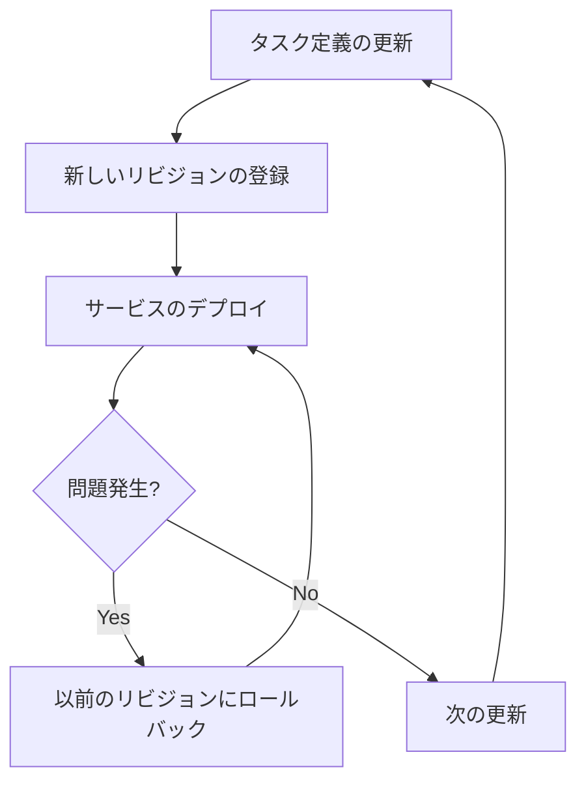

# revisions

`revisions`コマンドは、タスク定義のリビジョンを表示するために使用します。

## 構文

```
ecspresso revisions [オプション]
```

## オプション

| オプション | 説明 | デフォルト値 |
|------------|------|-------------|
| `--max-items` | 表示するリビジョンの最大数 | `100` |
| `--output` | 出力形式（table/json） | `table` |

## 使用例

### 基本的な使用方法

```bash
ecspresso revisions
```

### 最大表示数を指定

```bash
ecspresso revisions --max-items 10
```

### JSON形式で出力

```bash
ecspresso revisions --output json
```

## 出力例

```
FAMILY  REVISION        REGISTERED                      STATUS
myapp   10              2023-01-01 12:00:00 +0900 JST   ACTIVE
myapp   9               2022-12-31 12:00:00 +0900 JST   ACTIVE
myapp   8               2022-12-30 12:00:00 +0900 JST   INACTIVE
myapp   7               2022-12-29 12:00:00 +0900 JST   INACTIVE
```

## リビジョン管理のワークフロー

タスク定義のリビジョン管理は、ECSサービスの変更履歴を追跡するのに役立ちます。



## 注意事項

- リビジョンは、タスク定義が登録されるたびに自動的に増加します。
- `ACTIVE`状態のリビジョンは、新しいタスクの起動に使用できます。
- `INACTIVE`状態のリビジョンは、新しいタスクの起動には使用できませんが、実行中のタスクには影響しません。

## 関連コマンド

- [register](./register.html) - タスク定義を登録
- [deregister](./deregister.html) - タスク定義を登録解除
- [rollback](./rollback.html) - サービスをロールバック
