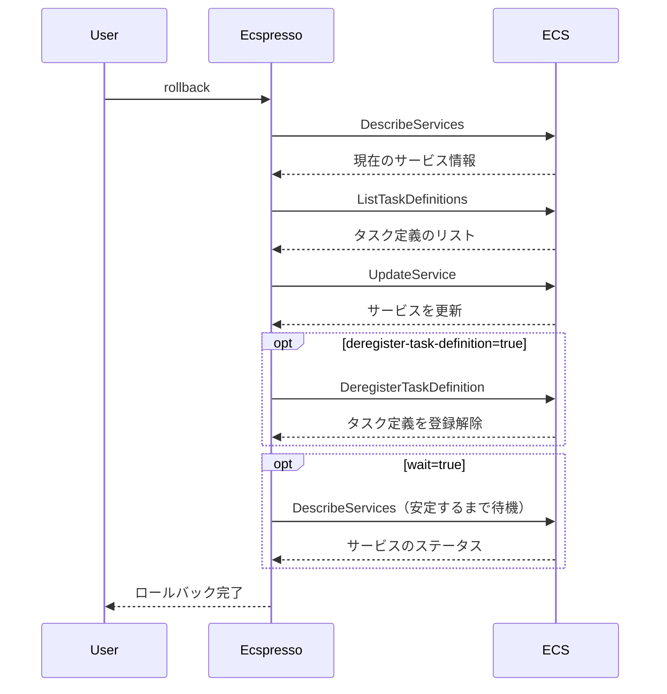

# rollback

`rollback`コマンドは、ECSサービスを以前のタスク定義にロールバックするために使用します。

## 構文

```
ecspresso rollback [オプション]
```

## オプション

| オプション | 説明 | デフォルト値 |
|------------|------|-------------|
| `--dry-run` | 実際の変更を行わずに実行内容を表示 | `false` |
| `--deregister-task-definition` | ロールバック後に現在のタスク定義を登録解除 | `false` |
| `--wait/--no-wait` | サービスが安定するまで待機するかどうか | `true` |
| `--wait-until` | どの状態まで待機するか（stable/deployed） | `stable` |
| `--revision` | ロールバック先のタスク定義リビジョン | （自動選択） |

## 使用例

### 基本的な使用方法（1つ前のリビジョンにロールバック）

```bash
ecspresso rollback
```

### 特定のリビジョンにロールバック

```bash
ecspresso rollback --revision 10
```

### ドライランモードでの実行

```bash
ecspresso rollback --dry-run
```

### 現在のタスク定義を登録解除してロールバック

```bash
ecspresso rollback --deregister-task-definition
```

## ロールバックプロセス

`rollback`コマンドは、以下の手順を実行します：

1. 現在のサービスで使用されているタスク定義を取得
2. 以前のリビジョンを特定（または`--revision`オプションで指定されたリビジョン）
3. サービスを更新して以前のタスク定義を使用
4. オプションで現在のタスク定義を登録解除



## ユースケース

- デプロイに問題が発生した場合に、迅速に以前の安定したバージョンに戻す
- 新しいバージョンのテスト後に、一時的に以前のバージョンに戻す
- 誤ったデプロイを修正する

## 関連コマンド

- [deploy](./deploy.html) - サービスをデプロイ
- [revisions](./revisions.html) - タスク定義のリビジョンを表示
