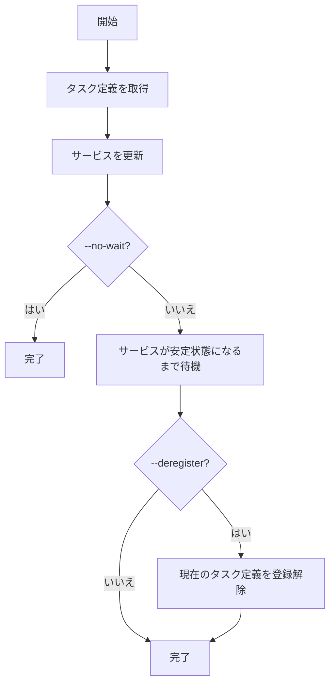

# rollback

`rollback`コマンドは、ECSサービスを以前のタスク定義にロールバックするためのコマンドです。デプロイに問題が発生した場合に、以前の安定した状態に戻すために使用します。

## 基本的な使い方

```console
$ ecspresso rollback [オプション]
```

## オプション

| オプション | 説明 | デフォルト値 |
|------------|------|------------|
| `--config` | 設定ファイルのパス | `ecspresso.yml` |
| `--revision` | ロールバックするタスク定義のリビジョン | - |
| `--deregister` | ロールバック後に現在のタスク定義を登録解除するかどうか | `false` |
| `--dry-run` | 実際にロールバックせずに実行内容を表示 | `false` |
| `--no-wait` | サービスが安定状態になるのを待たない | `false` |
| `--suspend-auto-scaling` | デプロイ中に自動スケーリングを一時停止 | `false` |
| `--resume-auto-scaling` | デプロイ後に自動スケーリングを再開 | `false` |

## 出力例

```
2023/01/01 12:00:00 [info] myservice/default Starting rollback
2023/01/01 12:00:00 [info] myservice/default Rolling back to task definition: arn:aws:ecs:ap-northeast-1:123456789012:task-definition/myservice:3
2023/01/01 12:00:00 [info] myservice/default Service is stable now. Completed!
```

## 使用例

### 基本的な使用方法

```console
$ ecspresso rollback --config ecspresso.yml --revision 3
```

### ドライラン

```console
$ ecspresso rollback --config ecspresso.yml --revision 3 --dry-run
```

### 現在のタスク定義を登録解除

```console
$ ecspresso rollback --config ecspresso.yml --revision 3 --deregister
```

### 自動スケーリングを一時停止して再開

```console
$ ecspresso rollback --config ecspresso.yml --revision 3 --suspend-auto-scaling --resume-auto-scaling
```

## ロールバックプロセス

`rollback`コマンドは、以下のプロセスでサービスをロールバックします：

1. 指定されたリビジョンのタスク定義を取得
2. サービスを更新して、指定されたタスク定義を使用するように変更
3. サービスが安定状態になるまで待機（`--no-wait`オプションが指定されていない場合）
4. 必要に応じて、現在のタスク定義を登録解除（`--deregister`オプションが指定されている場合）



## 自動ロールバック

`deploy`コマンドの`--rollback-events`オプションを使用すると、特定のイベントが発生した場合に自動的にロールバックするように設定できます。

```console
$ ecspresso deploy --config ecspresso.yml --rollback-events DEPLOYMENT_FAILURE
```

この場合、デプロイが失敗すると、ecspressoは自動的に以前のタスク定義にロールバックします。

## CI/CDパイプラインでの使用

`rollback`コマンドは、CI/CDパイプラインでデプロイの問題を自動的に検出し、ロールバックするのに役立ちます。以下は、GitHub Actionsでの使用例です：

```yaml
jobs:
  deploy:
    runs-on: ubuntu-latest
    steps:
      - uses: actions/checkout@v3
      - uses: kayac/ecspresso@v2
        with:
          version: v2.3.0
      - run: |
          # デプロイを実行
          ecspresso deploy --config ecspresso.yml || {
            # デプロイが失敗した場合、ロールバック
            echo "Deployment failed, rolling back..."
            PREVIOUS_REVISION=$(ecspresso revisions --config ecspresso.yml | sort -n | tail -2 | head -1)
            ecspresso rollback --config ecspresso.yml --revision $PREVIOUS_REVISION
            exit 1
          }
```

## 注意事項

- `--revision`オプションは必須です。ロールバックするタスク定義のリビジョンを指定する必要があります
- `--dry-run`オプションを使用すると、実際にロールバックせずに実行内容を確認できます
- `--deregister`オプションを使用すると、ロールバック後に現在のタスク定義を登録解除できます
- `--no-wait`オプションを使用すると、サービスが安定状態になるのを待たずにコマンドを終了できます
- `--suspend-auto-scaling`と`--resume-auto-scaling`オプションを使用すると、デプロイ中に自動スケーリングを一時停止し、デプロイ後に再開できます
- ロールバックは、サービスの更新として処理されるため、サービスの更新に関連する制限が適用されます
- Blue/Greenデプロイメントを使用している場合は、`rollback`コマンドではなく、AWS CodeDeployのロールバック機能を使用する必要があります

## 関連コマンド

- [deploy](./deploy.html) - サービスをデプロイ
- [revisions](./revisions.html) - タスク定義のリビジョンを一覧表示
- [register](./register.html) - タスク定義を登録
- [deregister](./deregister.html) - タスク定義の登録を解除
