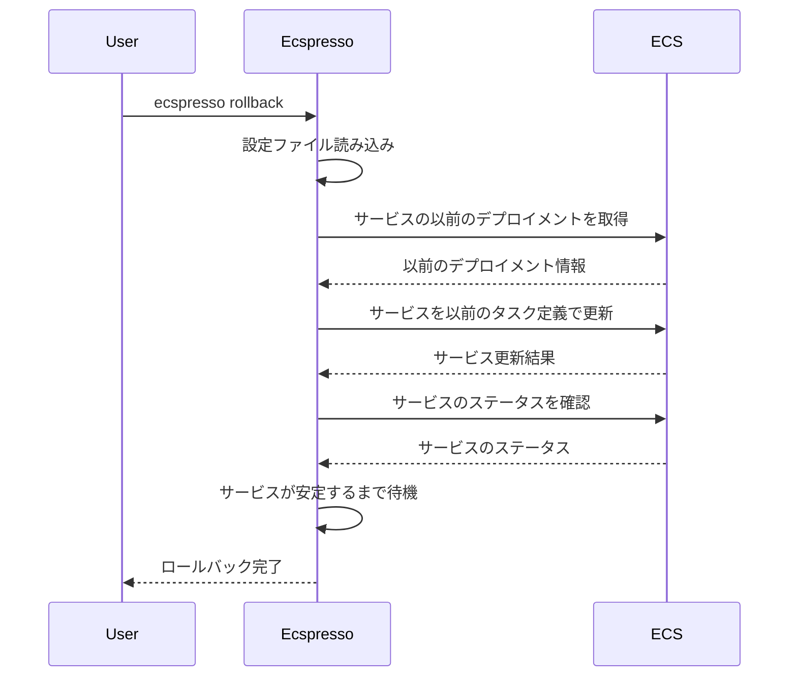

# rollback

`rollback`コマンドは、サービスを以前のタスク定義にロールバックします。

## 基本的な使い方

```bash
ecspresso rollback --config CONFIG_FILE
```

## オプション

| オプション | 説明 | デフォルト値 |
|------------|------|-------------|
| `--config` | 設定ファイルのパス | `ecspresso.yml` |
| `--tasks` | サービスのタスク数 | - |
| `--revision` | ロールバック先のタスク定義のリビジョン | - |
| `--deregister` | ロールバック後に現在のタスク定義を登録解除するかどうか | `false` |
| `--no-wait` | サービスが安定するまで待機しないかどうか | `false` |
| `--suspend-auto-scaling` | Auto Scalingを一時停止するかどうか | `false` |
| `--resume-auto-scaling` | デプロイ後にAuto Scalingを再開するかどうか | `false` |

## 詳細

`rollback`コマンドは、以下の処理を行います：

1. サービスの以前のデプロイメントを取得
2. 指定されたリビジョンまたは以前のタスク定義を使用してサービスを更新
3. サービスが安定するまで待機（`--no-wait`が指定されていない場合）

このコマンドは、デプロイに問題がある場合に以前の安定したバージョンに戻すのに役立ちます。

## ロールバックフロー



## 使用例

### 基本的なロールバック

```bash
ecspresso rollback --config ecspresso.yml
```

### 特定のリビジョンにロールバック

```bash
ecspresso rollback --config ecspresso.yml --revision 10
```

### タスク数を変更してロールバック

```bash
ecspresso rollback --config ecspresso.yml --tasks 5
```

### 現在のタスク定義を登録解除してロールバック

```bash
ecspresso rollback --config ecspresso.yml --deregister
```

### 待機せずにロールバック

```bash
ecspresso rollback --config ecspresso.yml --no-wait
```

### Auto Scalingを一時停止してロールバック

```bash
ecspresso rollback --config ecspresso.yml --suspend-auto-scaling
```

### ロールバック後にAuto Scalingを再開

```bash
ecspresso rollback --config ecspresso.yml --resume-auto-scaling
```

## ロールバックの仕組み

ecspressoは、以下の方法でロールバックを実行します：

1. サービスの以前のデプロイメントを取得します。
2. `--revision`オプションが指定されている場合は、指定されたリビジョンのタスク定義を使用します。
3. `--revision`オプションが指定されていない場合は、以前のデプロイメントで使用されていたタスク定義を使用します。
4. 取得したタスク定義を使用してサービスを更新します。
5. `--deregister`オプションが指定されている場合は、現在のタスク定義を登録解除します。

## 自動ロールバック

ecspressoは、`deploy`コマンドで`--rollback-events`オプションを使用することで、デプロイ失敗時に自動的にロールバックすることもできます。

```bash
ecspresso deploy --config ecspresso.yml --rollback-events DEPLOYMENT_FAILURE
```

このコマンドは、デプロイメントが失敗した場合に自動的に以前のバージョンにロールバックします。
