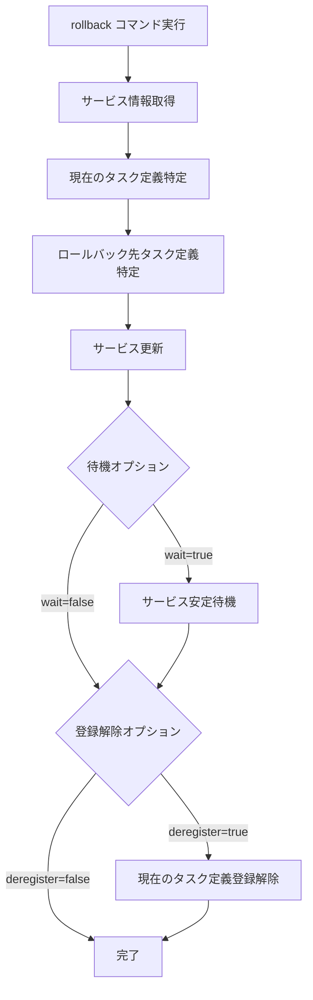

# rollback

`rollback`コマンドは、ECSサービスを以前のタスク定義にロールバックします。デプロイに問題が発生した場合に、サービスを以前の安定した状態に戻すのに役立ちます。

## 基本的な使い方

```bash
ecspresso rollback
```

## オプション

| オプション | 説明 | デフォルト値 |
|------------|------|------------|
| `--dry-run` | 実際の変更を行わずに実行 | `false` |
| `--tasks` | タスクの希望数 | 現在の値を維持 |
| `--wait` | サービスが安定するまで待機 | `true` |
| `--no-wait` | サービスが安定するまで待機しない | - |
| `--deregister` | ロールバック後に現在のタスク定義を登録解除 | `false` |
| `--revision` | ロールバック先のタスク定義リビジョン | 1つ前のリビジョン |

## ロールバックプロセス

`rollback`コマンドは以下のステップを実行します：

1. サービスの現在の状態を取得
2. 現在のタスク定義を特定
3. ロールバック先のタスク定義を特定（デフォルトでは1つ前のリビジョン）
4. サービスをロールバック先のタスク定義に更新
5. サービスの安定を待機（`--wait`が指定されている場合）
6. 必要に応じて現在のタスク定義を登録解除（`--deregister`が指定されている場合）



## 特定のリビジョンへのロールバック

デフォルトでは、`rollback`コマンドは1つ前のタスク定義リビジョンにロールバックします。特定のリビジョンにロールバックするには、`--revision`オプションを使用します：

```bash
# リビジョン10にロールバック
ecspresso rollback --revision=10
```

## タスク定義の登録解除

ロールバック後に現在のタスク定義を登録解除するには、`--deregister`オプションを使用します：

```bash
ecspresso rollback --deregister
```

これにより、ロールバック後に現在のタスク定義が登録解除され、タスク定義の履歴がクリーンに保たれます。

## 使用例

### 基本的なロールバック

```bash
ecspresso rollback
```

### ドライランモードでロールバック

```bash
ecspresso rollback --dry-run
```

### 特定のリビジョンにロールバック

```bash
ecspresso rollback --revision=15
```

### タスク数を変更してロールバック

```bash
ecspresso rollback --tasks=5
```

### ロールバック後にタスク定義を登録解除

```bash
ecspresso rollback --deregister
```

### 待機せずにロールバック

```bash
ecspresso rollback --no-wait
```

## 注意事項

- サービスが存在しない場合は、エラーが発生します。
- 指定したリビジョンが存在しない場合は、エラーが発生します。
- CodeDeployを使用している場合、`rollback`コマンドはCodeDeployのデプロイメントを作成してロールバックします。
- `--tasks`オプションで`-1`を指定すると、現在の希望数を維持します。
- スケジューリング戦略が`DAEMON`の場合、`--tasks`オプションは無視されます。
