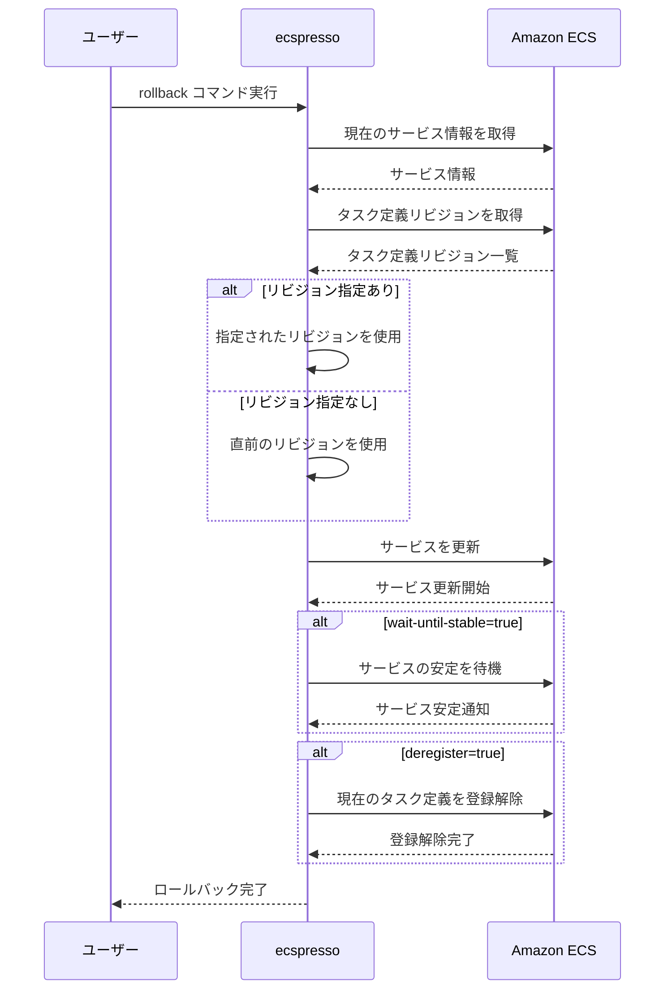

# rollback

`rollback`コマンドは、サービスを以前のタスク定義にロールバックします。

## 使い方

```console
$ ecspresso rollback --config ecspresso.yml
```

## オプション

| オプション | 説明 |
|------------|------|
| `--config` | 設定ファイルのパス（デフォルト: ecspresso.yml） |
| `--revision` | ロールバック先のタスク定義リビジョン |
| `--deregister` | ロールバック後に現在のタスク定義を登録解除 |
| `--wait-until-stable` | サービスが安定するまで待機（デフォルト: true） |
| `--no-wait-until-stable` | サービスが安定するまで待機しない |
| `--dry-run` | 実際にロールバックを行わずに実行内容を表示 |

## 使用例

### 基本的な使用方法（直前のリビジョンにロールバック）

```console
$ ecspresso rollback --config ecspresso.yml
```

### 特定のリビジョンにロールバック

```console
$ ecspresso rollback --config ecspresso.yml --revision 10
```

### ロールバック後に現在のタスク定義を登録解除

```console
$ ecspresso rollback --config ecspresso.yml --deregister
```

### ドライランモードで実行内容を確認

```console
$ ecspresso rollback --config ecspresso.yml --dry-run
```

## ロールバックフロー



## 注意事項

- リビジョンを指定しない場合、直前のリビジョンにロールバックされます。
- ロールバック先のタスク定義が存在しない場合、エラーが発生します。
- CodeDeployを使用したBlue/Greenデプロイメントの場合、このコマンドは使用できません。代わりにCodeDeployのロールバック機能を使用してください。
