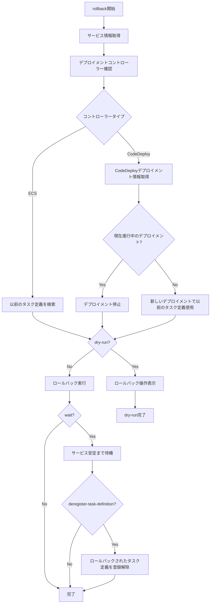

# rollback

`rollback`コマンドは、ECSサービスを以前のタスク定義にロールバックするために使用します。デプロイメントに問題が発生した場合に、以前の安定した状態に戻すことができます。

## 基本的な使い方

```console
$ ecspresso rollback --config ecspresso.yml
```

## オプション

|| オプション | 説明 | デフォルト値 |
|------------|------|-------------|
|| `--dry-run` | 実際にロールバックせずに、実行される操作を表示します | `false` |
|| `--deregister-task-definition` | ロールバックされたタスク定義を登録解除します（`--no-wait`と一緒に使用すると機能しません） | `true` |
|| `--wait` | サービスが安定するまで待機します | `true` |
|| `--wait-until` | サービスが安定するまで待機するか、デプロイメントが完了するまで待機するかを選択します（`stable`または`deployed`） | `stable` |
|| `--rollback-events` | 指定されたイベントが発生した場合にロールバックします（`DEPLOYMENT_FAILURE,DEPLOYMENT_STOP_ON_ALARM,DEPLOYMENT_STOP_ON_REQUEST,...`）CodeDeployのみ | `""` |

## 使用例

### 基本的なロールバック

```console
$ ecspresso rollback --config ecspresso.yml
```

### ドライランモード

```console
$ ecspresso rollback --config ecspresso.yml --dry-run
```

### タスク定義を登録解除せずにロールバック

```console
$ ecspresso rollback --config ecspresso.yml --no-deregister-task-definition
```

### 待機なしでロールバック

```console
$ ecspresso rollback --config ecspresso.yml --no-wait --no-deregister-task-definition
```

### デプロイメント完了時点で待機終了

```console
$ ecspresso rollback --config ecspresso.yml --wait-until deployed
```

### CodeDeployでロールバックイベントを指定

```console
$ ecspresso rollback --config ecspresso.yml --rollback-events DEPLOYMENT_FAILURE
```

## ロールバックフロー



## デプロイメントコントローラー別の動作

### ECSデプロイメントコントローラー

ECSデプロイメントコントローラーを使用している場合、`rollback`コマンドは以下の手順で動作します：

1. 現在のタスク定義の1つ前のリビジョンを検索
2. そのリビジョンを使用してサービスを更新
3. 必要に応じて、ロールバックされた（現在の）タスク定義を登録解除

### CodeDeployデプロイメントコントローラー

CodeDeployデプロイメントコントローラーを使用している場合、`rollback`コマンドは以下のいずれかの方法で動作します：

1. 進行中のデプロイメントがある場合：
   - デプロイメントを停止し、自動ロールバックを有効化

2. 進行中のデプロイメントがない場合：
   - 以前のタスク定義を使用して新しいデプロイメントを作成

## 注意事項

- `--deregister-task-definition`と`--no-wait`を同時に使用することはできません
- CodeDeployを使用している場合、`--rollback-events`オプションで自動ロールバックのトリガーとなるイベントを指定できます
- ロールバック先のタスク定義は、現在のタスク定義の1つ前のリビジョンです
- サービスに関連付けられたタスク定義のリビジョンが1つしかない場合、ロールバックはできません
