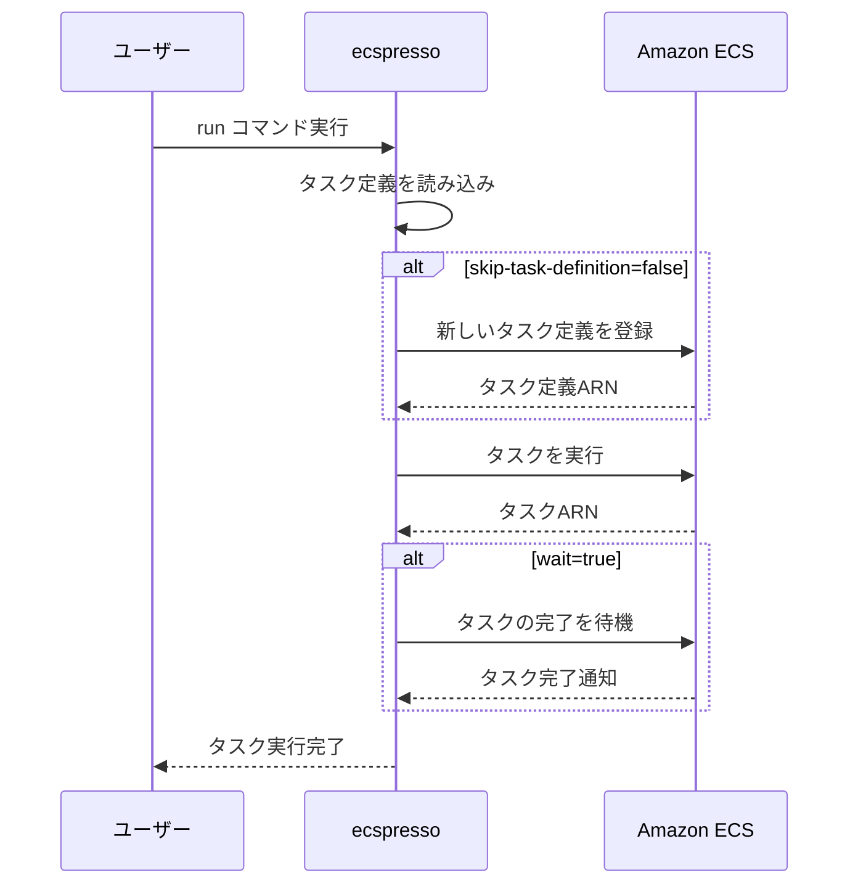

# run

`run`コマンドは、ECSタスクを実行します。サービスとは関係なく、一時的なタスクを実行するために使用します。

## 使い方

```console
$ ecspresso run --config ecspresso.yml
```

## オプション

| オプション | 説明 |
|------------|------|
| `--config` | 設定ファイルのパス（デフォルト: ecspresso.yml） |
| `--task-definition` | タスク定義のJSONファイルパス |
| `--revision` | 使用するタスク定義のリビジョン |
| `--latest-task-definition` | 最新のタスク定義を使用 |
| `--count` | 実行するタスクの数（デフォルト: 1） |
| `--launch-type` | 起動タイプ（EC2、FARGATE） |
| `--network-configuration` | ネットワーク設定（JSON形式） |
| `--cluster` | ECSクラスター名 |
| `--capacity-provider-strategy` | キャパシティプロバイダー戦略（JSON形式） |
| `--overrides` | タスク定義のオーバーライド（JSON形式） |
| `--container-overrides` | コンテナ定義のオーバーライド（JSON形式） |
| `--skip-task-definition` | タスク定義の登録をスキップ |
| `--wait` | タスクが完了するまで待機 |
| `--no-wait` | タスクが完了するまで待機しない（デフォルト） |
| `--timeout` | タイムアウト時間 |
| `--dry-run` | 実際にタスクを実行せずに実行内容を表示 |

## 使用例

### 基本的な使用方法

```console
$ ecspresso run --config ecspresso.yml
```

### 特定のタスク定義ファイルを使用

```console
$ ecspresso run --config ecspresso.yml --task-definition my-task-def.json
```

### 複数のタスクを実行

```console
$ ecspresso run --config ecspresso.yml --count 3
```

### コマンドをオーバーライド

```console
$ ecspresso run --config ecspresso.yml --container-overrides '{"name":"app","command":["echo","hello"]}'
```

### タスクが完了するまで待機

```console
$ ecspresso run --config ecspresso.yml --wait
```

## タスク実行フロー



## 注意事項

- このコマンドはサービスを更新せず、一時的なタスクを実行します。
- デフォルトでは、タスクの完了を待機しません。
- タスクが失敗した場合でも、エラーコードは返されません（`--wait`オプションを使用した場合を除く）。
- Fargateを使用する場合は、ネットワーク設定が必要です。
