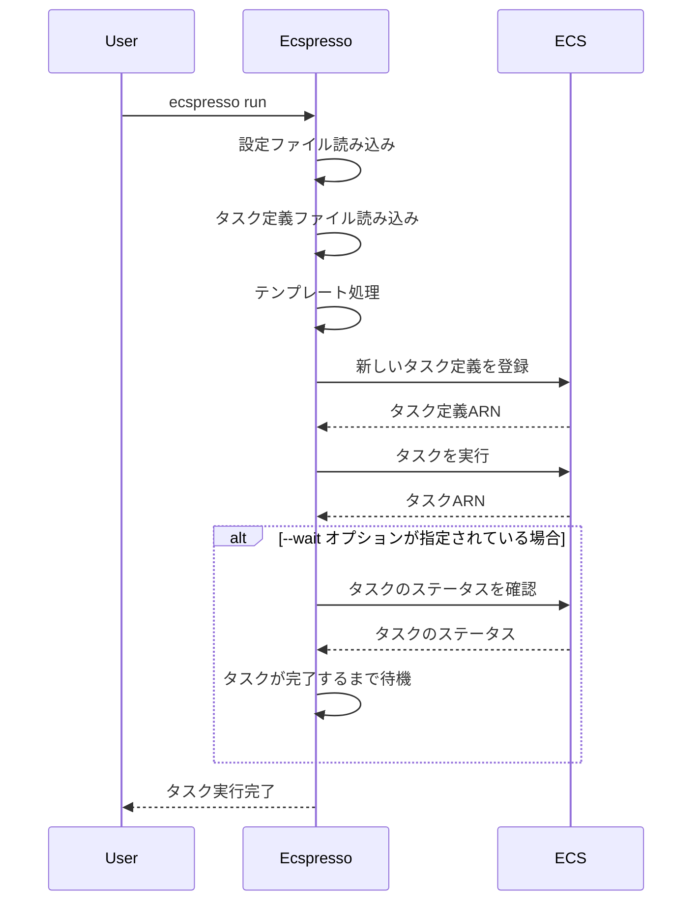

# run

`run`コマンドは、タスクを実行します。

## 基本的な使い方

```bash
ecspresso run --config CONFIG_FILE
```

## オプション

| オプション | 説明 | デフォルト値 |
|------------|------|-------------|
| `--config` | 設定ファイルのパス | `ecspresso.yml` |
| `--task-definition` | タスク定義ファイルのパス | 設定ファイルで指定されたパス |
| `--revision` | 使用するタスク定義のリビジョン | - |
| `--latest-task-definition` | 最新のタスク定義を使用するかどうか | `false` |
| `--count` | 実行するタスクの数 | `1` |
| `--launch-type` | 起動タイプ（EC2、FARGATE） | - |
| `--network-configuration` | ネットワーク設定（JSON形式） | - |
| `--cluster` | ECSクラスター名 | 設定ファイルで指定されたクラスター |
| `--platform-version` | プラットフォームバージョン | - |
| `--capacity-provider-strategy` | キャパシティプロバイダー戦略（JSON形式） | - |
| `--overrides` | タスク定義のオーバーライド（JSON形式） | - |
| `--skip-task-definition` | タスク定義の登録をスキップするかどうか | `false` |
| `--wait` | タスクが完了するまで待機するかどうか | `false` |
| `--no-wait` | タスクが完了するまで待機しないかどうか | `true` |
| `--startup-timeout` | 起動タイムアウト | `10m` |
| `--execution-timeout` | 実行タイムアウト | - |
| `--enable-execute-command` | ECS Execを有効にするかどうか | `false` |
| `--propagate-tags` | タグを伝播するかどうか | - |
| `--tags` | タスクに追加するタグ（JSON形式） | - |
| `--container-name` | コンテナ名 | - |
| `--container-port` | コンテナポート | - |
| `--forward-to` | ポートフォワーディング先 | - |

## 詳細

`run`コマンドは、以下の処理を行います：

1. タスク定義ファイルから新しいタスク定義を登録（`--skip-task-definition`が指定されていない場合）
2. 登録されたタスク定義を使用してタスクを実行
3. タスクが完了するまで待機（`--wait`が指定されている場合）

このコマンドは、バッチ処理やメンテナンス作業などの一時的なタスクを実行するのに役立ちます。

## タスク実行フロー



## 使用例

### 基本的なタスク実行

```bash
ecspresso run --config ecspresso.yml
```

### タスクが完了するまで待機

```bash
ecspresso run --config ecspresso.yml --wait
```

### 特定のリビジョンのタスク定義を使用

```bash
ecspresso run --config ecspresso.yml --revision 10
```

### 最新のタスク定義を使用

```bash
ecspresso run --config ecspresso.yml --latest-task-definition
```

### 複数のタスクを実行

```bash
ecspresso run --config ecspresso.yml --count 3
```

### FARGATEで実行

```bash
ecspresso run --config ecspresso.yml --launch-type FARGATE --network-configuration '{"awsvpcConfiguration":{"subnets":["subnet-12345678"],"securityGroups":["sg-12345678"],"assignPublicIp":"ENABLED"}}'
```

### コマンドをオーバーライドして実行

```bash
ecspresso run --config ecspresso.yml --overrides '{"containerOverrides":[{"name":"app","command":["php","artisan","migrate"]}]}'
```

### ポートフォワーディングを使用

```bash
ecspresso run --config ecspresso.yml --container-name app --container-port 80 --forward-to 8080
```

このコマンドは、コンテナのポート80をローカルポート8080にフォワーディングします。

## ポートフォワーディング

ecspressoは、タスク上のコンテナポートをローカルポートにフォワーディングする機能を提供しています。これにより、ローカル環境からタスク上のアプリケーションにアクセスできます。


ポートフォワーディングを使用するには、以下のオプションを指定します：

- `--container-name` - コンテナ名
- `--container-port` - コンテナポート
- `--forward-to` - ローカルポート

例：
```bash
ecspresso run --config ecspresso.yml --container-name app --container-port 80 --forward-to 8080
```

このコマンドは、タスクを実行し、コンテナ「app」のポート80をローカルポート8080にフォワーディングします。
