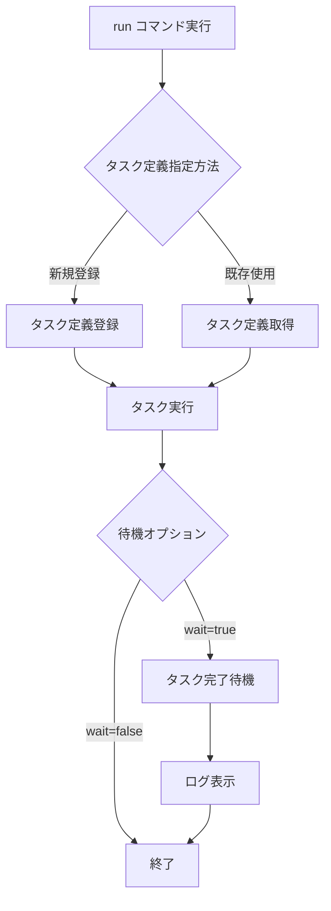

# run

`run`コマンドは、ECSクラスター上で一時的なタスクを実行します。メンテナンス作業やバッチ処理などに便利です。

## 基本的な使い方

```bash
ecspresso run
```

## オプション

| オプション | 説明 | デフォルト値 |
|------------|------|------------|
| `--dry-run` | 実際の変更を行わずに実行 | `false` |
| `--task-def` | 実行するタスク定義ファイル | 設定ファイルの`task_definition` |
| `--wait` | タスクが完了するまで待機 | `true` |
| `--no-wait` | タスクが完了するまで待機しない | - |
| `--overrides` | タスクオーバーライドのJSON文字列 | - |
| `--overrides-file` | タスクオーバーライドのJSONファイルパス | - |
| `--skip-task-definition` | 新しいタスク定義の登録をスキップ | `false` |
| `--count` | 実行するタスクの数（最大10） | `1` |
| `--watch-container` | 終了コードを監視するコンテナ名 | - |
| `--latest-task-definition` | 新しいタスク定義を登録せずに最新のタスク定義を使用 | `false` |
| `--propagate-tags` | タスクに伝播するタグ（SERVICE/TASK_DEFINITION） | - |
| `--tags` | タスクに設定するタグ（形式: Key=Value,Key=Value） | - |
| `--wait-until` | タスクの状態が指定された状態になるまで待機（running/stopped） | `stopped` |
| `--revision` | `--skip-task-definition`使用時に実行するタスク定義のリビジョン | `0` |
| `--client-token` | リクエストを識別する一意のトークン（べき等性に有用） | - |
| `--ebs-delete-on-termination` | タスク停止時にEBSボリュームを削除するかどうか | `true` |
| `--no-ebs-delete-on-termination` | タスク停止時にEBSボリュームを削除しない | - |

## タスク実行プロセス

`run`コマンドは以下のステップを実行します：

1. タスク定義を解決（新規登録または既存のものを使用）
2. タスクオーバーライドを適用（指定されている場合）
3. タスクを実行
4. タスクの完了を待機（`--wait`が指定されている場合）
5. ログを表示（CloudWatch Logsが設定されている場合）



## タスクオーバーライド

タスクオーバーライドを使用すると、タスク定義を変更せずにコマンドや環境変数などを上書きできます。

JSONオーバーライド文字列の例：

```bash
ecspresso run --overrides='{"containerOverrides":[{"name":"app","command":["echo","hello"]}]}'
```

または、JSONファイルを使用する場合：

```bash
# overrides.json
{
  "containerOverrides": [
    {
      "name": "app",
      "command": ["echo", "hello"],
      "environment": [
        {
          "name": "DEBUG",
          "value": "true"
        }
      ]
    }
  ]
}

# コマンド実行
ecspresso run --overrides-file=overrides.json
```

## タスク実行のログ表示

タスク定義でCloudWatch Logsが設定されている場合、`run`コマンドはタスクの実行中にログを表示します。ログを表示するコンテナは`--watch-container`オプションで指定できます。

```bash
ecspresso run --watch-container=app
```

## タスクへのタグ付け

タスクにタグを付けるには、`--tags`オプションを使用します：

```bash
ecspresso run --tags="Environment=dev,Project=demo"
```

また、サービスやタスク定義からタグを伝播させることもできます：

```bash
ecspresso run --propagate-tags=SERVICE
```

または：

```bash
ecspresso run --propagate-tags=TASK_DEFINITION
```

## 使用例

### 基本的なタスク実行

```bash
ecspresso run
```

### コマンドをオーバーライドしてタスク実行

```bash
ecspresso run --overrides='{"containerOverrides":[{"name":"app","command":["./batch.sh"]}]}'
```

### 複数のタスクを実行

```bash
ecspresso run --count=3
```

### 特定のリビジョンのタスク定義を使用

```bash
ecspresso run --skip-task-definition --revision=10
```

### タスクが実行状態になるまで待機

```bash
ecspresso run --wait-until=running
```

### 環境変数を上書きしてタスク実行

```bash
ecspresso run --overrides='{"containerOverrides":[{"name":"app","environment":[{"name":"DEBUG","value":"true"}]}]}'
```

### タグを付けてタスク実行

```bash
ecspresso run --tags="Environment=dev,Project=demo,Task=backup"
```

### EBSボリュームを保持してタスク実行

```bash
ecspresso run --no-ebs-delete-on-termination
```

## 注意事項

- `--count`オプションの最大値は10です。より多くのタスクを実行する場合は、複数回コマンドを実行する必要があります。
- `--wait-until=running`を指定すると、タスクが実行状態になった時点で待機が終了します。タスクの完了を待機するには、デフォルトの`stopped`を使用してください。
- CloudWatch Logsが設定されていない場合、ログは表示されません。
- タスクが失敗した場合（終了コードが0以外）、エラーが返されます。
