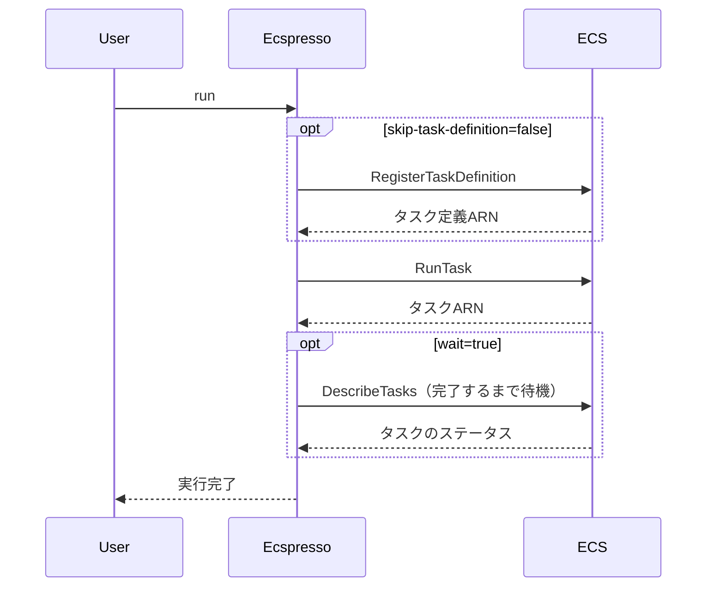

# run

`run`コマンドは、ECSタスクを一時的に実行するために使用します。

## 構文

```
ecspresso run [オプション]
```

## オプション

| オプション | 説明 | デフォルト値 |
|------------|------|-------------|
| `--dry-run` | 実際の変更を行わずに実行内容を表示 | `false` |
| `--count` | 実行するタスクの数 | `1` |
| `--group` | タスクグループ名 | `` |
| `--container-instances` | タスクを実行するコンテナインスタンスのARN（カンマ区切り） | `` |
| `--overrides` | タスク定義のオーバーライド（JSON形式） | `` |
| `--skip-task-definition` | 新しいタスク定義の登録をスキップ | `false` |
| `--revision` | `--skip-task-definition`指定時に使用するタスク定義のリビジョン | `0` |
| `--launch-type` | 起動タイプ（EC2/FARGATE） | （設定ファイルの値） |
| `--network-configuration` | ネットワーク設定（JSON形式） | （設定ファイルの値） |
| `--platform-version` | プラットフォームバージョン（FARGATE起動タイプの場合） | （設定ファイルの値） |
| `--capacity-provider-strategy` | キャパシティプロバイダー戦略（JSON形式） | （設定ファイルの値） |
| `--started-by` | タスクの開始者 | `ecspresso` |
| `--wait/--no-wait` | タスクが完了するまで待機するかどうか | `false` |
| `--latest-task-definition` | 新しいタスク定義を登録せずに最新のタスク定義でタスクを実行 | `false` |

## 使用例

### 基本的な使用方法

```bash
ecspresso run
```

### コマンドをオーバーライドして実行

```bash
ecspresso run --overrides '{"containerOverrides":[{"name":"app","command":["echo", "hello world"]}]}'
```

### 複数のタスクを実行

```bash
ecspresso run --count 3
```

### タスクが完了するまで待機

```bash
ecspresso run --wait
```

### 特定のコンテナインスタンスでタスクを実行

```bash
ecspresso run --container-instances arn:aws:ecs:ap-northeast-1:123456789012:container-instance/12345678-1234-1234-1234-123456789012
```

## タスク実行プロセス

`run`コマンドは、以下の手順を実行します：

1. タスク定義を登録（`--skip-task-definition`が指定されていない場合）
2. タスクを実行
3. オプションでタスクが完了するまで待機



## ユースケース

- バッチ処理の実行
- データベースマイグレーションの実行
- メンテナンスタスクの実行
- デバッグ目的でのコンテナの起動

## 関連コマンド

- [exec](./exec.html) - タスク上でコマンドを実行
- [tasks](./tasks.html) - サービス内またはタスク定義ファミリー内のタスクを一覧表示
