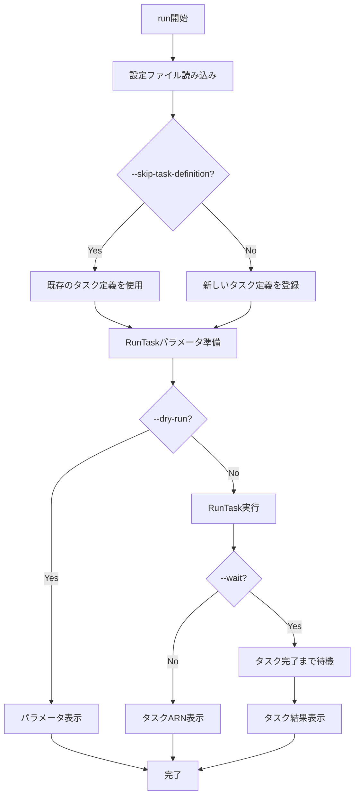

# run

`run`コマンドは、ECSで一時的なタスクを実行します。バッチ処理やメンテナンス作業など、一時的な処理を行うのに便利です。

## 基本的な使い方

```console
$ ecspresso run --config ecspresso.yml --task-definition ecs-task-def.json
```

## オプション

| オプション | 説明 | デフォルト値 |
|------------|------|-------------|
| `--config FILE` | 設定ファイルのパス | `ecspresso.yml` |
| `--task-definition FILE` | タスク定義ファイルのパス | 設定ファイルの`task_definition`値 |
| `--revision N` | 使用するタスク定義のリビジョン | `0` (最新) |
| `--count N` | 実行するタスクの数 | `1` |
| `--launch-type TYPE` | 起動タイプ（`EC2`または`FARGATE`） | タスク定義から自動判定 |
| `--cluster CLUSTER` | ECSクラスター名 | 設定ファイルの`cluster`値 |
| `--network-configuration JSON` | ネットワーク設定（JSON形式） | - |
| `--overrides JSON` | タスク定義のオーバーライド（JSON形式） | - |
| `--container-overrides JSON` | コンテナ定義のオーバーライド（JSON形式） | - |
| `--skip-task-definition` | 新しいタスク定義の登録をスキップ | `false` |
| `--wait` | タスクが完了するまで待機 | `false` |
| `--latest-task-definition` | 最新のタスク定義を使用 | `false` |
| `--platform-version VERSION` | Fargateのプラットフォームバージョン | `LATEST` |
| `--capacity-provider-strategy JSON` | キャパシティプロバイダー戦略（JSON形式） | - |
| `--group NAME` | タスクグループ名 | - |
| `--propagate-tags` | タグの伝播（`TASK_DEFINITION`または`SERVICE`） | - |
| `--tags JSON` | タスクに付けるタグ（JSON形式） | - |
| `--enable-execute-command` | ExecuteCommandを有効にする | `false` |
| `--dry-run` | 実際にタスクを実行せずに、実行される操作を表示 | `false` |

## 使用例

### 基本的なタスク実行

```console
$ ecspresso run --config ecspresso.yml --task-definition ecs-task-def.json
```

### 複数のタスクを実行

```console
$ ecspresso run --config ecspresso.yml --task-definition ecs-task-def.json --count 3
```

### コマンドをオーバーライドして実行

```console
$ ecspresso run --config ecspresso.yml --task-definition ecs-task-def.json --container-overrides '{"containerOverrides":[{"name":"app","command":["echo","hello"]}]}'
```

### 環境変数をオーバーライドして実行

```console
$ ecspresso run --config ecspresso.yml --task-definition ecs-task-def.json --container-overrides '{"containerOverrides":[{"name":"app","environment":[{"name":"DEBUG","value":"true"}]}]}'
```

### タスクが完了するまで待機

```console
$ ecspresso run --config ecspresso.yml --task-definition ecs-task-def.json --wait
```

### ドライランモード

```console
$ ecspresso run --config ecspresso.yml --task-definition ecs-task-def.json --dry-run
```

## タスク実行フロー

`run`コマンドの実行フローは以下の通りです：



## 注意事項

- `run`コマンドは、サービスではなく一時的なタスクを実行します
- タスク定義ファイルを指定しない場合、設定ファイルの`task_definition`値が使用されます
- `--overrides`または`--container-overrides`オプションを使用して、タスク定義の一部をオーバーライドできます
- `--wait`オプションを指定すると、すべてのタスクが完了するまでコマンドはブロックされます
- Fargateを使用する場合、`--network-configuration`オプションが必要です
- `--enable-execute-command`オプションを指定すると、`exec`コマンドでタスクに接続できます
