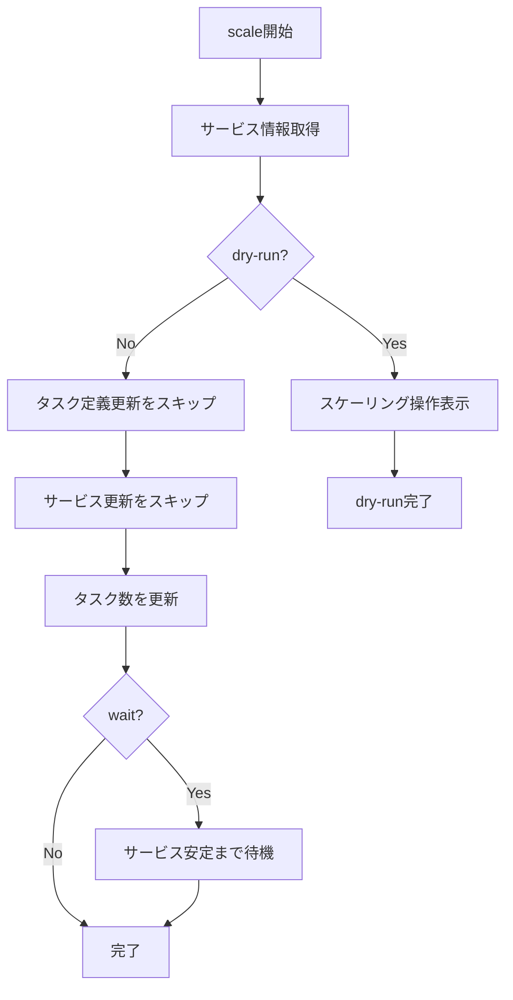

# scale

`scale`コマンドは、ECSサービスのタスク数をスケーリングするために使用します。このコマンドは、`deploy --skip-task-definition --no-update-service`と同等です。

## 基本的な使い方

```console
$ ecspresso scale --config ecspresso.yml --tasks 5
```

## オプション

|| オプション | 説明 | デフォルト値 |
|------------|------|-------------|
|| `--dry-run` | 実際にスケーリングせずに、実行される操作を表示します | `false` |
|| `--tasks` | タスクの希望数 | 現在の値を維持 |
|| `--wait` | サービスが安定するまで待機します | `true` |

## 使用例

### タスク数を5に設定

```console
$ ecspresso scale --config ecspresso.yml --tasks 5
```

### ドライランモード

```console
$ ecspresso scale --config ecspresso.yml --tasks 10 --dry-run
```

### 待機なしでスケーリング

```console
$ ecspresso scale --config ecspresso.yml --tasks 3 --no-wait
```

## スケーリングフロー



## ユースケース

`scale`コマンドは以下のような場合に役立ちます：

1. トラフィック増加に対応するためにタスク数を増やす場合
2. コスト削減のためにタスク数を減らす場合
3. メンテナンスのためにサービスを一時的にスケールダウンする場合

## 注意事項

- このコマンドは新しいタスク定義を登録せず、現在のタスク定義を使用します
- サービス定義の更新も行われないため、サービスの設定は変更されません
- タスク数のみが変更されます
- オートスケーリングが設定されている場合、手動でスケーリングした後にオートスケーリングによって上書きされる可能性があります
