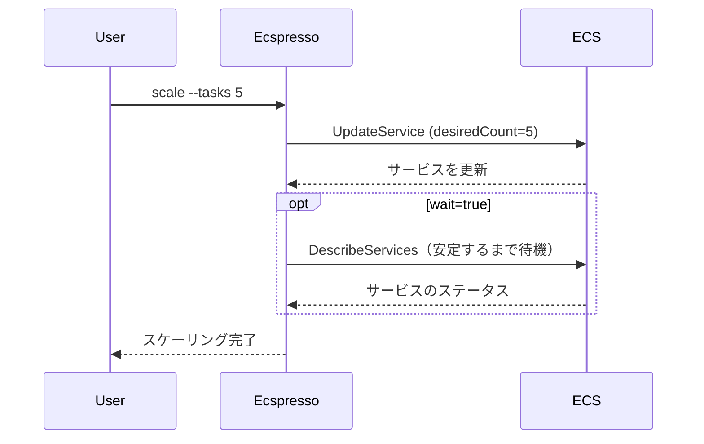

# scale

`scale`コマンドは、ECSサービスのタスク数を変更するために使用します。このコマンドは、`deploy --skip-task-definition --no-update-service`と同等の機能を持ちます。

## 構文

```
ecspresso scale [オプション]
```

## オプション

| オプション | 説明 | デフォルト値 |
|------------|------|-------------|
| `--dry-run` | 実際の変更を行わずに実行内容を表示 | `false` |
| `--tasks` | 設定するタスクの希望数 | （必須） |
| `--wait/--no-wait` | サービスが安定するまで待機するかどうか | `true` |
| `--wait-until` | どの状態まで待機するか（stable/deployed） | `stable` |

## 使用例

### 基本的な使用方法

```bash
ecspresso scale --tasks 5
```

### ドライランモードでの実行

```bash
ecspresso scale --tasks 10 --dry-run
```

### 待機せずにスケール

```bash
ecspresso scale --tasks 3 --no-wait
```

## スケーリングプロセス

`scale`コマンドは、サービスの希望タスク数を変更します。タスク定義は更新せず、サービス定義も更新しません。



## ユースケース

- トラフィック増加に対応するためのスケールアップ
- コスト削減のためのスケールダウン
- メンテナンス中の一時的なスケーリング
- 定期的なスケーリングの自動化（CI/CDパイプラインと組み合わせて）

## 注意事項

- スケーリング操作は、サービスのデプロイメント設定（最小ヘルス率、最大率）に従います。
- スケールダウン時は、ECSがどのタスクを停止するかを決定します。
- アプリケーションオートスケーリングが設定されている場合、手動スケーリング後にオートスケーリングによって上書きされる可能性があります。

## 関連コマンド

- [deploy](./deploy.html) - サービスをデプロイ
- [status](./status.html) - サービスの状態を表示
