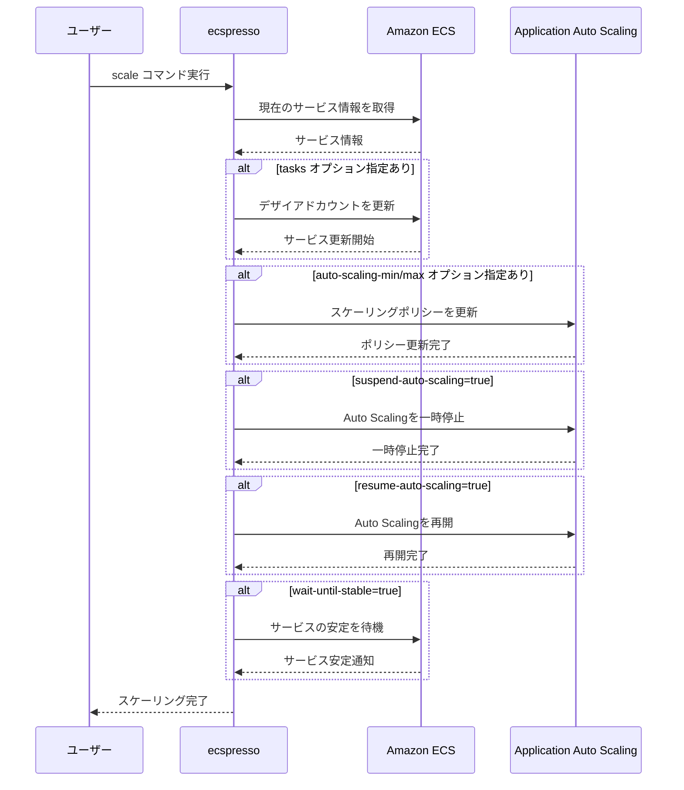

# scale

`scale`コマンドは、サービスのタスク数を変更します。これは`deploy --skip-task-definition --no-update-service`と同等の機能を持ちます。

## 使い方

```console
$ ecspresso scale --config ecspresso.yml --tasks 10
```

## オプション

| オプション | 説明 |
|------------|------|
| `--config` | 設定ファイルのパス（デフォルト: ecspresso.yml） |
| `--tasks` | 設定するタスク数 |
| `--wait-until-stable` | サービスが安定するまで待機（デフォルト: true） |
| `--no-wait-until-stable` | サービスが安定するまで待機しない |
| `--suspend-auto-scaling` | Auto Scalingを一時停止 |
| `--resume-auto-scaling` | Auto Scalingを再開 |
| `--auto-scaling-min` | Auto Scalingの最小値を設定 |
| `--auto-scaling-max` | Auto Scalingの最大値を設定 |
| `--dry-run` | 実際にスケールを行わずに実行内容を表示 |

## 使用例

### 基本的な使用方法

```console
$ ecspresso scale --config ecspresso.yml --tasks 10
```

### Auto Scalingの設定を変更

```console
$ ecspresso scale --config ecspresso.yml --auto-scaling-min 5 --auto-scaling-max 20
```

### Auto Scalingを一時停止

```console
$ ecspresso scale --config ecspresso.yml --suspend-auto-scaling
```

### Auto Scalingを再開

```console
$ ecspresso scale --config ecspresso.yml --resume-auto-scaling
```

### ドライランモードで実行内容を確認

```console
$ ecspresso scale --config ecspresso.yml --tasks 10 --dry-run
```

## スケーリングフロー



## 注意事項

- このコマンドはタスク定義を更新せず、タスク数のみを変更します。
- Auto Scalingが有効な場合、`--tasks`オプションで設定したタスク数は、Auto Scalingによって上書きされる可能性があります。
- Auto Scalingの設定を変更する場合は、`--auto-scaling-min`と`--auto-scaling-max`オプションを使用してください。
