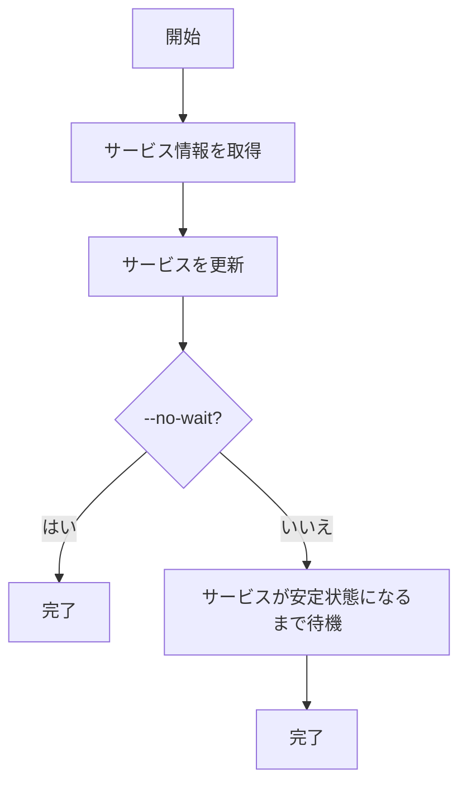

# scale

`scale`コマンドは、ECSサービスのタスク数を変更するためのコマンドです。サービスの負荷に応じてタスク数を手動で調整する場合に使用します。

## 基本的な使い方

```console
$ ecspresso scale --tasks N [オプション]
```

## オプション

| オプション | 説明 | デフォルト値 |
|------------|------|------------|
| `--config` | 設定ファイルのパス | `ecspresso.yml` |
| `--tasks` | 設定するタスク数 | - |
| `--dry-run` | 実際にスケールせずに実行内容を表示 | `false` |
| `--no-wait` | サービスが安定状態になるのを待たない | `false` |

## 出力例

```
2023/01/01 12:00:00 [info] myservice/default Starting scale
2023/01/01 12:00:00 [info] myservice/default Scaling service to 5 tasks
2023/01/01 12:00:00 [info] myservice/default Service is stable now. Completed!
```

## 使用例

### 基本的な使用方法

```console
$ ecspresso scale --config ecspresso.yml --tasks 5
```

### ドライラン

```console
$ ecspresso scale --config ecspresso.yml --tasks 5 --dry-run
```

### 安定状態を待たない

```console
$ ecspresso scale --config ecspresso.yml --tasks 5 --no-wait
```

## スケーリングプロセス

`scale`コマンドは、以下のプロセスでサービスをスケールします：

1. 現在のサービス情報を取得
2. サービスを更新して、タスク数を変更
3. サービスが安定状態になるまで待機（`--no-wait`オプションが指定されていない場合）



## 自動スケーリングとの関係

`scale`コマンドは、手動でタスク数を変更するためのコマンドです。自動スケーリングが設定されている場合は、以下の点に注意してください：

1. `scale`コマンドで設定したタスク数は、自動スケーリングによって上書きされる可能性があります
2. 自動スケーリングを一時的に無効にするには、AWS Application Auto Scalingの`suspend-scaling-policy`コマンドを使用します
3. 自動スケーリングを再開するには、AWS Application Auto Scalingの`resume-scaling-policy`コマンドを使用します

```bash
# 自動スケーリングを一時停止
$ aws application-autoscaling suspend-scaling-policy \
  --service-namespace ecs \
  --scalable-dimension ecs:service:DesiredCount \
  --resource-id service/my-cluster/myservice \
  --policy-name cpu-tracking-scaling-policy

# タスク数を変更
$ ecspresso scale --config ecspresso.yml --tasks 5

# 自動スケーリングを再開
$ aws application-autoscaling resume-scaling-policy \
  --service-namespace ecs \
  --scalable-dimension ecs:service:DesiredCount \
  --resource-id service/my-cluster/myservice \
  --policy-name cpu-tracking-scaling-policy
```

## CI/CDパイプラインでの使用

`scale`コマンドは、CI/CDパイプラインでサービスのタスク数を自動的に調整するのに役立ちます。以下は、GitHub Actionsでの使用例です：

```yaml
jobs:
  scale:
    runs-on: ubuntu-latest
    steps:
      - uses: actions/checkout@v3
      - uses: kayac/ecspresso@v2
        with:
          version: v2.3.0
      - run: |
          # 平日の朝にタスク数を増やす
          if [ $(date +%u) -le 5 ] && [ $(date +%H) -eq 8 ]; then
            ecspresso scale --config ecspresso.yml --tasks 10
          fi
          
          # 平日の夜にタスク数を減らす
          if [ $(date +%u) -le 5 ] && [ $(date +%H) -eq 20 ]; then
            ecspresso scale --config ecspresso.yml --tasks 2
          fi
```

## スケジュールに基づくスケーリング

AWS Application Auto Scalingを使用して、スケジュールに基づいてタスク数を自動的に調整することもできます。

```bash
# 平日の朝にタスク数を増やすスケジュールを作成
$ aws application-autoscaling put-scheduled-action \
  --service-namespace ecs \
  --scalable-dimension ecs:service:DesiredCount \
  --resource-id service/my-cluster/myservice \
  --scheduled-action-name scale-up-weekday-morning \
  --schedule "cron(0 8 ? * MON-FRI *)" \
  --scalable-target-action MinCapacity=5,MaxCapacity=10

# 平日の夜にタスク数を減らすスケジュールを作成
$ aws application-autoscaling put-scheduled-action \
  --service-namespace ecs \
  --scalable-dimension ecs:service:DesiredCount \
  --resource-id service/my-cluster/myservice \
  --scheduled-action-name scale-down-weekday-evening \
  --schedule "cron(0 20 ? * MON-FRI *)" \
  --scalable-target-action MinCapacity=2,MaxCapacity=2
```

## 注意事項

- `--tasks`オプションは必須です。設定するタスク数を指定する必要があります
- `--dry-run`オプションを使用すると、実際にスケールせずに実行内容を確認できます
- `--no-wait`オプションを使用すると、サービスが安定状態になるのを待たずにコマンドを終了できます
- タスク数を0に設定することもできますが、その場合はサービスが実行されなくなります
- タスク数を大幅に増やす場合は、クラスターのリソース制限に注意してください
- 自動スケーリングが設定されている場合は、`scale`コマンドで設定したタスク数が上書きされる可能性があります
- スケーリング操作は、サービスの更新として処理されるため、サービスの更新に関連する制限が適用されます

## 関連コマンド

- [deploy](./deploy.html) - サービスをデプロイ
- [status](./status.html) - サービスの状態を表示
- [wait](./wait.html) - サービスが安定状態になるまで待機
