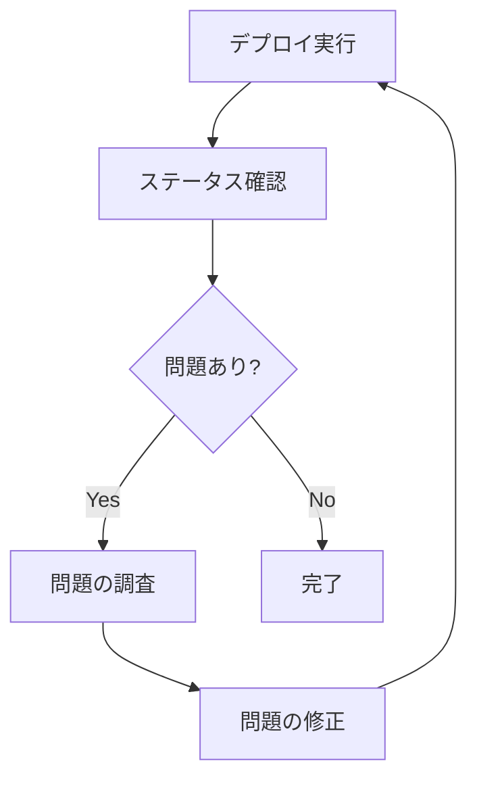

# status

`status`コマンドは、ECSサービスの現在の状態を表示するために使用します。

## 構文

```
ecspresso status [オプション]
```

## オプション

| オプション | 説明 | デフォルト値 |
|------------|------|-------------|
| `--events` | サービスイベントを表示 | `false` |
| `--tasks` | サービス内のタスクを表示 | `false` |
| `--output` | 出力形式（table/json） | `table` |

## 使用例

### 基本的な使用方法

```bash
ecspresso status
```

### サービスイベントを表示

```bash
ecspresso status --events
```

### サービス内のタスクを表示

```bash
ecspresso status --tasks
```

### JSON形式で出力

```bash
ecspresso status --output json
```

## 出力例

```
Service: myapp
Status: ACTIVE
TaskDefinition: myapp:10
Deployments:
  PRIMARY myapp:10 desired:3 pending:0 running:3
Events:
  2023-01-01 12:00:00 +0900 JST (service myapp) has reached a steady state.
Tasks:
  RUNNING 12345678-1234-1234-1234-123456789012 myapp:10 10.0.0.1
  RUNNING 23456789-2345-2345-2345-234567890123 myapp:10 10.0.0.2
  RUNNING 34567890-3456-3456-3456-345678901234 myapp:10 10.0.0.3
```

## ステータス確認のワークフロー



## 注意事項

- `--events`オプションを使用すると、最近のサービスイベントが表示されます。これは、デプロイの問題を診断するのに役立ちます。
- `--tasks`オプションを使用すると、サービス内の現在のタスクが表示されます。これは、個々のタスクの状態を確認するのに役立ちます。
- デプロイ後にサービスが安定しているかどうかを確認するために、`status`コマンドを使用することをお勧めします。

## 関連コマンド

- [deploy](./deploy.html) - サービスをデプロイ
- [tasks](./tasks.html) - サービス内またはタスク定義ファミリー内のタスクを一覧表示
- [wait](./wait.html) - サービスが安定するまで待機
