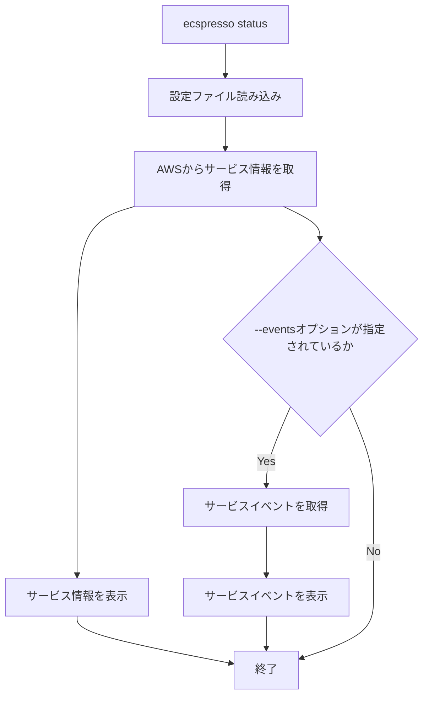

# status

`status`コマンドは、ECSサービスの現在のステータスを表示します。

## 基本的な使い方

```bash
ecspresso status --config CONFIG_FILE
```

## オプション

| オプション | 説明 | デフォルト値 |
|------------|------|-------------|
| `--config` | 設定ファイルのパス | `ecspresso.yml` |
| `--events` | サービスイベントを表示するかどうか | `false` |
| `--output` | 出力形式（table, json, yaml） | `table` |

## 詳細

`status`コマンドは、以下の情報を表示します：

1. サービスの基本情報（名前、クラスター、ステータス）
2. デプロイメント情報（実行中のタスク数、保留中のタスク数）
3. タスク定義情報（ARN、リビジョン）
4. ネットワーク設定
5. ロードバランサー設定
6. Auto Scaling設定（有効な場合）
7. サービスイベント（`--events`オプションが指定されている場合）

## 出力例

### テーブル形式（デフォルト）

```
Service: myservice
Cluster: default
Status: ACTIVE
Desired: 2
Running: 2
Pending: 0
TaskDefinition: arn:aws:ecs:ap-northeast-1:123456789012:task-definition/myservice:10
```

### JSON形式

```json
{
  "service": {
    "serviceArn": "arn:aws:ecs:ap-northeast-1:123456789012:service/default/myservice",
    "serviceName": "myservice",
    "clusterArn": "arn:aws:ecs:ap-northeast-1:123456789012:cluster/default",
    "status": "ACTIVE",
    "desiredCount": 2,
    "runningCount": 2,
    "pendingCount": 0,
    "taskDefinition": "arn:aws:ecs:ap-northeast-1:123456789012:task-definition/myservice:10",
    "deploymentConfiguration": {
      "deploymentCircuitBreaker": {
        "enable": false,
        "rollback": false
      },
      "maximumPercent": 200,
      "minimumHealthyPercent": 100
    },
    "deployments": [
      {
        "id": "ecs-svc/1234567890123456789",
        "status": "PRIMARY",
        "taskDefinition": "arn:aws:ecs:ap-northeast-1:123456789012:task-definition/myservice:10",
        "desiredCount": 2,
        "pendingCount": 0,
        "runningCount": 2,
        "createdAt": "2023-01-01T00:00:00Z",
        "updatedAt": "2023-01-01T00:00:00Z"
      }
    ]
  }
}
```

## 使用例

### 基本的な使用例

```bash
ecspresso status --config ecspresso.yml
```

### サービスイベントを表示する例

```bash
ecspresso status --config ecspresso.yml --events
```

### JSON形式で出力する例

```bash
ecspresso status --config ecspresso.yml --output json
```

### YAML形式で出力する例

```bash
ecspresso status --config ecspresso.yml --output yaml
```

## ワークフロー


