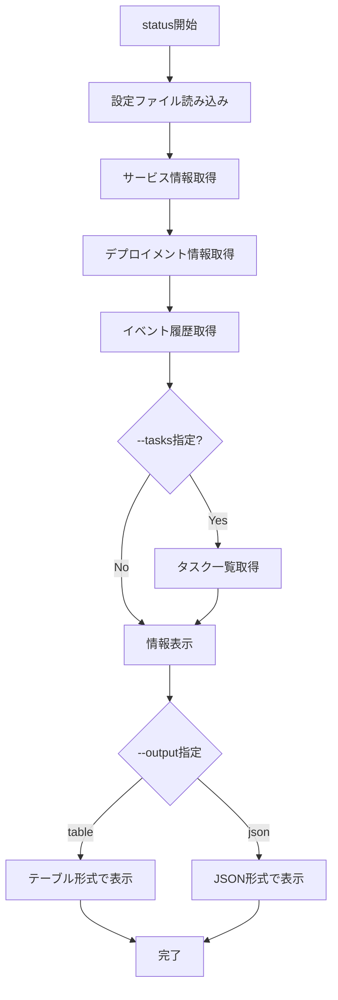

# status

`status`コマンドは、ECSサービスの現在の状態を表示します。サービスの実行状況、タスク数、イベント履歴などを確認できます。

## 基本的な使い方

```console
$ ecspresso status --config ecspresso.yml
```

## オプション

| オプション | 説明 | デフォルト値 |
|------------|------|-------------|
| `--config FILE` | 設定ファイルのパス | `ecspresso.yml` |
| `--events N` | 表示するイベント数 | `10` |
| `--tasks` | タスク一覧も表示する | `false` |
| `--output OUTPUT` | 出力形式（`table`または`json`） | `table` |

## 使用例

### 基本的な状態表示

```console
$ ecspresso status --config ecspresso.yml
```

### より多くのイベントを表示

```console
$ ecspresso status --config ecspresso.yml --events 20
```

### タスク一覧も表示

```console
$ ecspresso status --config ecspresso.yml --tasks
```

### JSON形式で出力

```console
$ ecspresso status --config ecspresso.yml --output json
```

## 表示される情報

`status`コマンドは、以下の情報を表示します：

1. サービスの基本情報
   - サービス名
   - クラスター名
   - タスク定義
   - 起動タイプ（EC2、Fargate）
   - デプロイメントコントローラーのタイプ

2. デプロイメント情報
   - 現在のデプロイメント
   - 進行中のデプロイメント
   - 希望するタスク数
   - 実行中のタスク数
   - 保留中のタスク数

3. イベント履歴
   - 最近のサービスイベント（デフォルトで10件）
   - イベントの発生時刻
   - イベントのメッセージ

4. タスク情報（`--tasks`オプション使用時）
   - タスクID
   - タスクの状態
   - 起動時刻
   - 最終ステータス変更時刻

## 状態確認フロー

`status`コマンドの実行フローは以下の通りです：



## 注意事項

- サービスが存在しない場合、エラーが表示されます
- `--tasks`オプションを使用すると、追加のAPI呼び出しが発生するため、表示に時間がかかる場合があります
- イベント履歴は新しいものから順に表示されます
- JSON形式で出力する場合、すべての情報が含まれます
