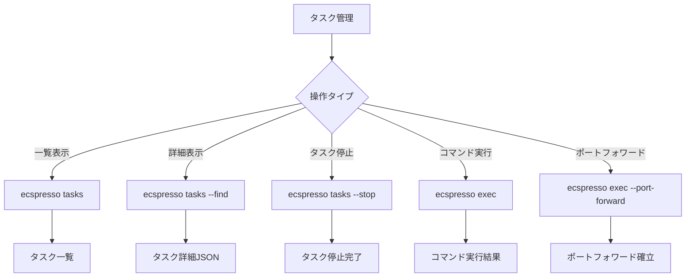

# タスク関連コマンド

ecspressoのタスク管理に関連するコマンドを説明します。

## tasks

`tasks`コマンドは、サービスによって実行されているタスクやタスク定義と同じファミリーを持つタスクを一覧表示します。

```console
$ ecspresso tasks [オプション]
```

### 主なオプション

| オプション | 説明 |
|------------|------|
| `--id` | タスクID |
| `--output` | 出力形式（デフォルト: table） |
| `--find` | タスクリストからタスクを検索してJSON形式で出力 |
| `--stop` | タスクを停止 |
| `--force` | 確認なしでタスクを停止 |
| `--trace` | タスクをトレース |

### 使用例

タスク一覧の表示：
```console
$ ecspresso tasks
```

特定のタスクの詳細を表示：
```console
$ ecspresso tasks --find
```

タスクの停止：
```console
$ ecspresso tasks --stop
```

## exec

`exec`コマンドは、タスク上でコマンドを実行します。このコマンドを使用するには、PATHに[session-manager-plugin](https://docs.aws.amazon.com/systems-manager/latest/userguide/session-manager-working-with-install-plugin.html)が必要です。

```console
$ ecspresso exec [オプション]
```

### 主なオプション

| オプション | 説明 |
|------------|------|
| `--id` | タスクID |
| `--command` | 実行するコマンド（デフォルト: sh） |
| `--container` | コンテナ名 |
| `--port-forward` | ポートフォワーディングを有効にする |
| `--local-port` | ローカルポート番号 |
| `--port` | リモートポート番号（ポートフォワーディングに必要） |
| `--host` | リモートホスト（ポートフォワーディングに必要） |
| `-L` | local-port:host:portの短縮表現 |

### 使用例

タスク上でシェルを実行：
```console
$ ecspresso exec
```

特定のコマンドを実行：
```console
$ ecspresso exec --command "ls -la"
```

ポートフォワーディング：
```console
$ ecspresso exec --port-forward --port 80 --local-port 8080
```

または短縮形式：
```console
$ ecspresso exec --port-forward -L 8080:localhost:80
```

## タスク管理フロー図

以下はタスク管理のフロー図です：


