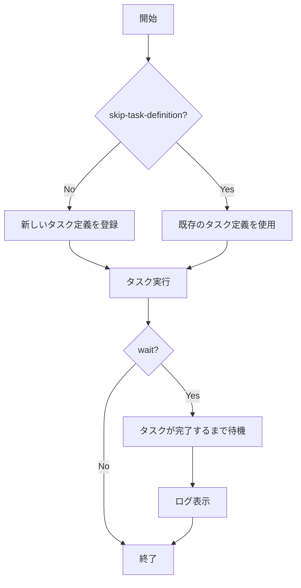

# タスク関連コマンド

## run

`run`コマンドは、一時的なタスクを実行します。

```
Usage: ecspresso run [options]

Options:
  --dry-run                       ドライラン（実際には変更を行わない）
  --task-def=FILE                 実行するタスク定義ファイル
  --[no-]wait                     タスクが完了するまで待機 (デフォルト: true)
  --overrides=JSON                タスクオーバーライドJSON文字列
  --overrides-file=FILE           タスクオーバーライドJSONファイルパス
  --skip-task-definition          新しいタスク定義の登録をスキップ
  --count=N                       実行するタスクの数 (最大10) (デフォルト: 1)
  --watch-container=NAME          終了コードを監視するコンテナ名
  --latest-task-definition        新しいタスク定義を登録せずに最新のタスク定義を使用
  --propagate-tags=TYPE           タスクのタグを伝播 (SERVICE または TASK_DEFINITION)
  --tags=KEY=VALUE,...            タスクのタグ: 形式は KeyFoo=ValueFoo,KeyBar=ValueBar
  --wait-until=STATE              呼び出されたタスクのステータスが到達するまで待機 (running または stopped) (デフォルト: stopped)
  --revision=N                    --skip-task-definitionと共に使用する場合のタスク定義リビジョン
  --client-token=TOKEN            リクエストを識別する一意のトークン（べき等性に役立つ）
  --[no-]ebs-delete-on-termination タスクが停止したときにEBSボリュームを削除するかどうか (デフォルト: true)
```

### 使用例

```console
# 基本的なタスク実行
$ ecspresso run

# 3つのタスクを実行
$ ecspresso run --count=3

# タスクオーバーライドを使用
$ ecspresso run --overrides='{"containerOverrides":[{"name":"app","command":["echo","hello"]}]}'

# タスクが実行状態になるまで待機
$ ecspresso run --wait-until=running
```

### タスク実行フロー



## exec

`exec`コマンドは、実行中のタスクでコマンドを実行します。

```
Usage: ecspresso exec [options]

Options:
  --id=ID                         タスクID
  --command=COMMAND               実行するコマンド (デフォルト: "sh")
  --container=NAME                コンテナ名
```

### 使用例

```console
# タスクIDを指定してシェルを実行
$ ecspresso exec --id=12345678-1234-1234-1234-123456789012

# 特定のコンテナでコマンドを実行
$ ecspresso exec --id=12345678-1234-1234-1234-123456789012 --container=app --command="ls -la"
```

## tasks

`tasks`コマンドは、サービスのタスクまたは同じファミリーを持つタスクを一覧表示します。

```
Usage: ecspresso tasks [options]

Options:
  --id=ID                         タスクID
  --output=FORMAT                 出力形式 (table, json, tsv) (デフォルト: table)
  --find                          タスクリストからタスクを検索し、JSONとしてダンプ
```

### 使用例

```console
# サービスのタスクを一覧表示
$ ecspresso tasks

# JSON形式で出力
$ ecspresso tasks --output=json

# 特定のタスクの詳細を表示
$ ecspresso tasks --id=12345678-1234-1234-1234-123456789012

# タスクを検索してJSON形式で詳細を表示
$ ecspresso tasks --find
```

## register

`register`コマンドは、新しいタスク定義を登録します。

```
Usage: ecspresso register [options]

Options:
  --dry-run                       ドライラン（実際には変更を行わない）
  --task-def=FILE                 登録するタスク定義ファイル
```

### 使用例

```console
# タスク定義を登録
$ ecspresso register

# 特定のタスク定義ファイルを登録
$ ecspresso register --task-def=my-task-def.json

# ドライランで登録（実際には変更を行わない）
$ ecspresso register --dry-run
```

## deregister

`deregister`コマンドは、タスク定義を登録解除します。

```
Usage: ecspresso deregister [options]

Options:
  --dry-run                       ドライラン（実際には変更を行わない）
  --keeps=N                       使用中のものを除いて保持するタスク定義の数
  --revision=N                    登録解除するリビジョン番号または 'latest'
```

### 使用例

```console
# 最新のタスク定義を登録解除
$ ecspresso deregister --revision=latest

# 最新の5つを除いて古いタスク定義を登録解除
$ ecspresso deregister --keeps=5
```

## revisions

`revisions`コマンドは、タスク定義のリビジョンを表示します。

```
Usage: ecspresso revisions [options]

Options:
  --revision=N                    リビジョン番号または 'current' または 'latest'
  --output=FORMAT                 出力形式 (json, table, tsv) (デフォルト: table)
```

### 使用例

```console
# タスク定義のリビジョンを一覧表示
$ ecspresso revisions

# 現在のリビジョンを表示
$ ecspresso revisions --revision=current

# JSON形式で出力
$ ecspresso revisions --output=json
```
