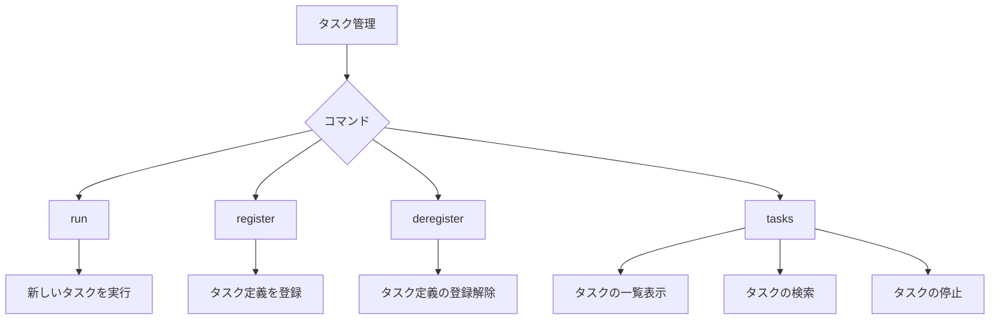
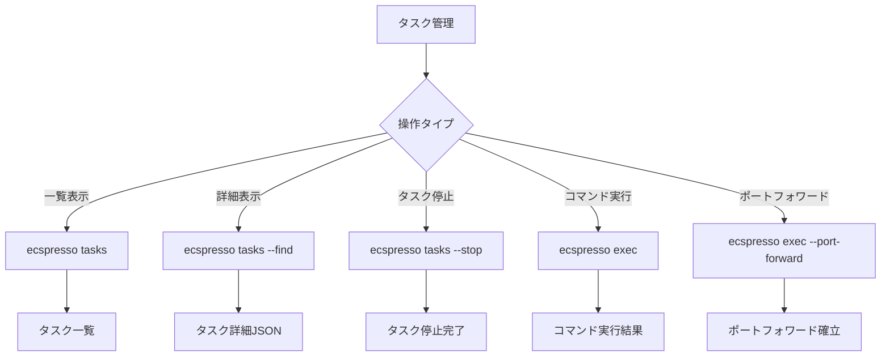

# タスク関連コマンド

## run

`run`コマンドは、タスクを実行します。

```
ecspresso run [オプション]
```

### オプション

| オプション | 説明 | デフォルト |
|----------|------|----------|
| `--dry-run` | 実際の変更を行わずに動作確認 | false |
| `--task-def FILE` | 実行するタスク定義ファイル | - |
| `--no-wait` | タスクの完了を待機しない | false |
| `--overrides JSON` | タスクオーバーライドのJSON文字列 | - |
| `--overrides-file FILE` | タスクオーバーライドのJSONファイルパス | - |
| `--skip-task-definition` | 新しいタスク定義の登録をスキップ | false |
| `--count N` | 実行するタスクの数（最大10） | 1 |
| `--watch-container NAME` | 終了コードを監視するコンテナ名 | - |
| `--latest-task-definition` | 新しいタスク定義を登録せずに最新のタスク定義を使用 | false |
| `--propagate-tags STRING` | タスクのタグを伝播（SERVICEまたはTASK_DEFINITION） | - |
| `--tags STRING` | タスクのタグ：形式はKeyFoo=ValueFoo,KeyBar=ValueBar | - |
| `--wait-until STRING` | 呼び出されたタスクのステータスが到達するまで待機（runningまたはstopped） | stopped |
| `--revision N` | `--skip-task-definition`使用時に実行するタスク定義のリビジョン | 0 |
| `--client-token STRING` | リクエストを識別する一意のトークン（べき等性に有用） | - |
| `--no-ebs-delete-on-termination` | タスク停止時にEBSボリュームを削除しない | false |

## register

`register`コマンドは、タスク定義を登録します。

```
ecspresso register [オプション]
```

### オプション

| オプション | 説明 | デフォルト |
|----------|------|----------|
| `--dry-run` | 実際の変更を行わずに動作確認 | false |
| `--task-def FILE` | 登録するタスク定義ファイル | - |

## deregister

`deregister`コマンドは、タスク定義の登録を解除します。

```
ecspresso deregister [オプション]
```

### オプション

| オプション | 説明 | デフォルト |
|----------|------|----------|
| `--dry-run` | 実際の変更を行わずに動作確認 | false |
| `--revision N` | 登録解除するタスク定義のリビジョン | current |

## tasks

`tasks`コマンドは、サービスによって実行されるタスクまたは同じファミリーを持つタスクを一覧表示します。

```
ecspresso tasks [オプション]
```

### オプション

| オプション | 説明 | デフォルト |
|----------|------|----------|
| `--id ID` | タスクID | - |
| `--output FORMAT` | 出力形式 | table |
| `--find` | タスクリストからタスクを検索しJSONとして出力 | false |
| `--stop` | タスクを停止 | false |
| `--force` | 確認なしでタスクを停止 | false |
| `--trace` | タスクをトレース | false |

### タスクの管理フロー



## exec

`exec`コマンドは、タスク上でコマンドを実行します。

```
ecspresso exec [オプション]
```

### オプション

| オプション | 説明 | デフォルト |
|----------|------|----------|
| `--id ID` | タスクID | - |
| `--command CMD` | 実行するコマンド | sh |
| `--container NAME` | コンテナ名 | - |
| `--port-forward` | ポートフォワードを有効にする | false |
| `--local-port N` | ローカルポート番号 | 0 |
| `--port N` | リモートポート番号（`--port-forward`に必要） | 0 |
| `--host HOST` | リモートホスト（`--port-forward`に必要） | - |
| `-L` | local-port:host:portの短い表現 | - |

**注意**: PATH内に[session-manager-plugin](https://docs.aws.amazon.com/systems-manager/latest/userguide/session-manager-working-with-install-plugin.html)が必要です。

ecspressoのタスク管理に関連するコマンドを説明します。

## tasks

`tasks`コマンドは、サービスによって実行されているタスクやタスク定義と同じファミリーを持つタスクを一覧表示します。v2では、タスクの詳細情報の表示と検索機能が強化されました。

```console
$ ecspresso tasks [オプション]
```

### 主なオプション

| オプション | 説明 |
|------------|------|
| `--id` | タスクID |
| `--output` | 出力形式（デフォルト: table） |
| `--find` | タスクリストからタスクを検索してJSON形式で出力 |
| `--stop` | タスクを停止 |
| `--force` | 確認なしでタスクを停止 |
| `--trace` | タスクをトレース |
| `--container` | 特定のコンテナを指定（v2で追加） |
| `--filter` | タスクのフィルタリング条件（v2で追加） |

### 使用例

タスク一覧の表示：
```console
$ ecspresso tasks
```

特定のタスクの詳細を表示：
```console
$ ecspresso tasks --find
```

タスクの停止：
```console
$ ecspresso tasks --stop
```

## exec

`exec`コマンドは、タスク上でコマンドを実行します。このコマンドを使用するには、PATHに[session-manager-plugin](https://docs.aws.amazon.com/systems-manager/latest/userguide/session-manager-working-with-install-plugin.html)が必要です。v2では、複数のポートフォワーディングと対話的なコンテナ選択がサポートされました。

```console
$ ecspresso exec [オプション]
```

### 主なオプション

| オプション | 説明 |
|------------|------|
| `--id` | タスクID |
| `--command` | 実行するコマンド（デフォルト: sh） |
| `--container` | コンテナ名 |
| `--port-forward` | ポートフォワーディングを有効にする |
| `--local-port` | ローカルポート番号 |
| `--port` | リモートポート番号（ポートフォワーディングに必要） |
| `--host` | リモートホスト（ポートフォワーディングに必要） |
| `-L` | local-port:host:portの短縮表現（v2では複数指定可能） |
| `--interactive` | 対話的にコンテナを選択（v2で追加） |
| `--timeout` | コマンド実行のタイムアウト（v2で追加） |

### 使用例

タスク上でシェルを実行：
```console
$ ecspresso exec
```

特定のコマンドを実行：
```console
$ ecspresso exec --command "ls -la"
```

ポートフォワーディング：
```console
$ ecspresso exec --port-forward --port 80 --local-port 8080
```

または短縮形式：
```console
$ ecspresso exec --port-forward -L 8080:localhost:80
```

## タスク管理フロー図

以下はタスク管理のフロー図です：


