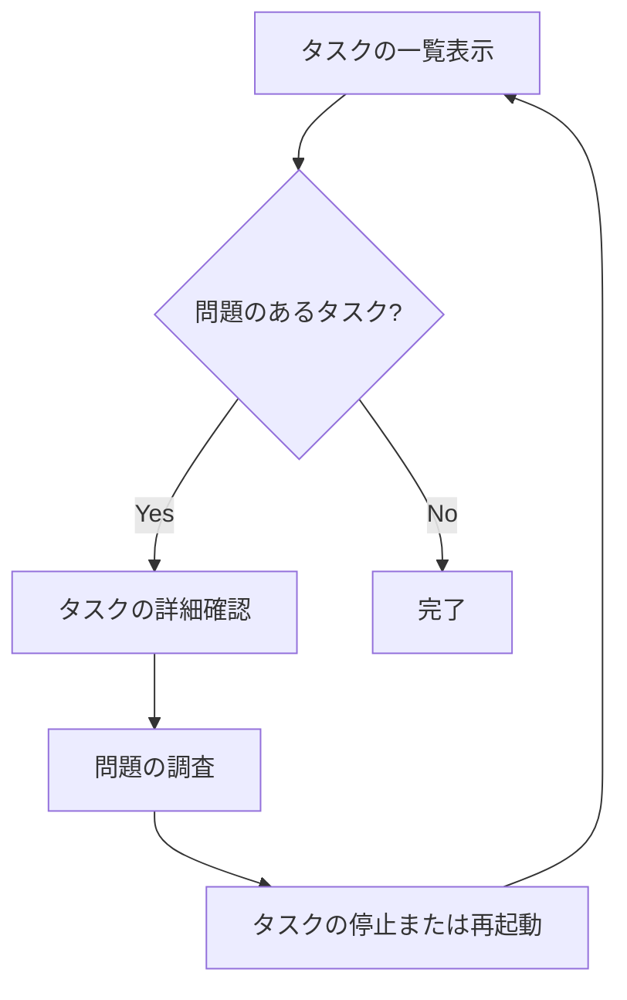

# tasks

`tasks`コマンドは、サービス内またはタスク定義ファミリー内のタスクを一覧表示するために使用します。

## 構文

```
ecspresso tasks [オプション]
```

## オプション

| オプション | 説明 | デフォルト値 |
|------------|------|-------------|
| `--id` | 特定のタスクIDを表示 | `` |
| `--output` | 出力形式（table/json） | `table` |
| `--find-stopped` | 停止したタスクも含める | `false` |
| `--status` | フィルタリングするタスクのステータス（RUNNING/STOPPED/...） | `` |
| `--container-instance` | コンテナインスタンスでフィルタリング | `false` |
| `--task-definition` | タスク定義でフィルタリング | `false` |
| `--filter` | タスクをフィルタリングするための式 | `` |

## 使用例

### 基本的な使用方法

```bash
ecspresso tasks
```

### 停止したタスクも含めて表示

```bash
ecspresso tasks --find-stopped
```

### 特定のステータスのタスクのみを表示

```bash
ecspresso tasks --status RUNNING
```

### JSON形式で出力

```bash
ecspresso tasks --output json
```

### 特定のタスクの詳細を表示

```bash
ecspresso tasks --id 12345678-1234-1234-1234-123456789012
```

## 出力例

```
ID                                    STATUS   TASK DEFINITION   STARTED     STOPPED
12345678-1234-1234-1234-123456789012  RUNNING  myapp:10         2023-01-01  -
23456789-2345-2345-2345-234567890123  RUNNING  myapp:10         2023-01-01  -
34567890-3456-3456-3456-345678901234  STOPPED  myapp:9          2022-12-31  2023-01-01
```

## タスク管理のワークフロー



## 注意事項

- デフォルトでは、実行中のタスクのみが表示されます。停止したタスクも表示するには、`--find-stopped`オプションを使用します。
- `--id`オプションを使用すると、特定のタスクの詳細情報が表示されます。
- `--filter`オプションを使用すると、複雑な条件でタスクをフィルタリングできます。

## 関連コマンド

- [status](./status.html) - サービスの状態を表示
- [exec](./exec.html) - タスク上でコマンドを実行
- [run](./run.html) - タスクを実行
