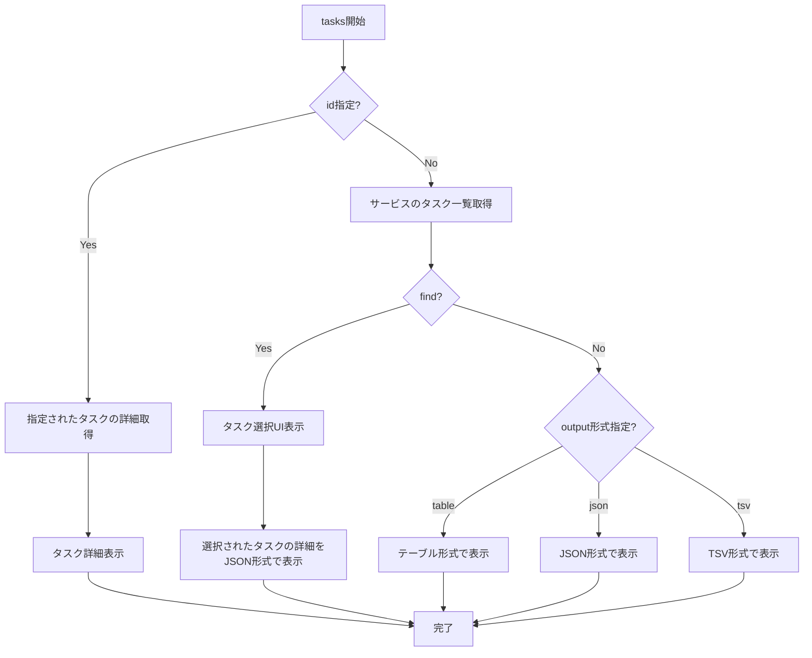

# tasks

`tasks`コマンドは、サービスに関連するタスクまたは同じファミリーを持つタスクの一覧を表示するために使用します。特定のタスクの詳細情報も表示できます。

## 基本的な使い方

```console
$ ecspresso tasks --config ecspresso.yml
```

## オプション

|| オプション | 説明 | デフォルト値 |
|------------|------|-------------|
|| `--id` | タスクID | `""` |
|| `--output` | 出力形式（`table`、`json`、`tsv`） | `table` |
|| `--find` | タスク一覧から特定のタスクを検索し、JSON形式で出力 | `false` |

## 使用例

### サービスのタスク一覧を表示

```console
$ ecspresso tasks --config ecspresso.yml
```

### 特定のタスクの詳細を表示

```console
$ ecspresso tasks --config ecspresso.yml --id arn:aws:ecs:ap-northeast-1:123456789012:task/cluster-name/abcdef1234567890
```

### JSON形式で出力

```console
$ ecspresso tasks --config ecspresso.yml --output json
```

### TSV形式で出力

```console
$ ecspresso tasks --config ecspresso.yml --output tsv
```

### タスク一覧から特定のタスクを検索

```console
$ ecspresso tasks --config ecspresso.yml --find
```

## タスク一覧表示フロー



## 出力例（テーブル形式）

```
+------------------+----------+---------------+-------------+----------------+
|       TASK       |  STATUS  |    HEALTH     |  LAUNCHED   |    INSTANCE    |
+------------------+----------+---------------+-------------+----------------+
| abcdef1234567890 | RUNNING  | HEALTHY       | 2 hours ago | fargate        |
| bcdef12345678901 | RUNNING  | HEALTHY       | 2 hours ago | fargate        |
| cdef123456789012 | RUNNING  | HEALTHY       | 2 hours ago | fargate        |
+------------------+----------+---------------+-------------+----------------+
```

## 注意事項

- `--id`オプションを指定すると、特定のタスクの詳細情報のみが表示されます
- `--find`オプションを使用すると、タスク一覧から対話的に特定のタスクを選択できます
- テーブル形式の出力では、タスクID、ステータス、ヘルスステータス、起動時間、インスタンスタイプが表示されます
- JSON形式の出力では、タスクの完全な詳細情報が表示されます
