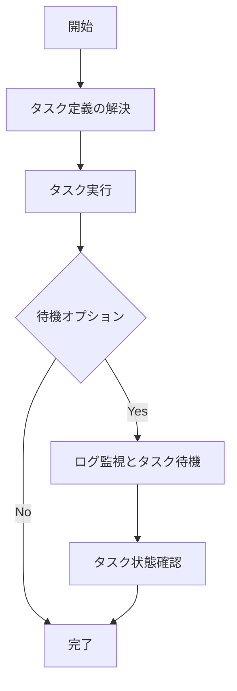

# タスク管理コマンド

## run

ECSタスクを実行します。

```
Usage: ecspresso run [flags]

Flags:
  --dry-run                         ドライラン（実際の変更は行わない）
  --task-def=FILE                   実行するタスク定義ファイル
  --[no-]wait                       タスク完了まで待機（デフォルト：true）
  --overrides=JSON                  タスクオーバーライドJSON文字列
  --overrides-file=FILE             タスクオーバーライドJSONファイル
  --skip-task-definition            新しいタスク定義の登録をスキップ
  --count=N                         実行するタスク数（最大10）（デフォルト：1）
  --watch-container=NAME            終了コードを監視するコンテナ名
  --latest-task-definition          新しいタスク定義を登録せずに最新のタスク定義を使用
  --propagate-tags=TYPE             タスクへのタグ伝播（SERVICE or TASK_DEFINITION）
  --tags=KEY=VALUE,...              タスクのタグ
  --wait-until=CONDITION            待機条件（running:実行中、stopped:停止）（デフォルト：stopped）
  --revision=N                      --skip-task-definitionを指定時に使用するリビジョン番号
  --client-token=TOKEN              リクエスト識別のためのトークン（冪等性）
  --[no-]ebs-delete-on-termination  タスク停止時にEBSボリュームを削除（デフォルト：true）
```

### 例

基本的なタスク実行：
```console
$ ecspresso run
```

コマンドオーバーライドでタスク実行：
```console
$ ecspresso run --overrides='{"containerOverrides":[{"name":"app","command":["migrate"]}]}'
```

特定のタスク定義を使用：
```console
$ ecspresso run --task-def=batch-task.json
```

### タスク実行フロー



## exec

実行中のタスクにコマンドを実行します。

```
Usage: ecspresso exec [flags]

Flags:
  --command="COMMAND"          実行するコマンド
  --container=NAME             コマンドを実行するコンテナ名
  --task-id=ID                 コマンドを実行するタスクID
  --timeout=DURATION           コマンド実行のタイムアウト
  --interactive                対話型モードで実行
```

### 例

特定のタスクでコマンド実行：
```console
$ ecspresso exec --task-id=12345678 --container=app --command="ls -la"
```

対話型シェルの起動：
```console
$ ecspresso exec --task-id=12345678 --container=app --command="/bin/bash" --interactive
```

## tasks

サービスまたは同じファミリーを持つタスクの一覧を表示します。

```
Usage: ecspresso tasks [flags]

Flags:
  --status=STATUS      タスクのステータスでフィルタ（RUNNING, STOPPED）
  --id-only            タスクIDのみを出力
  --find=PATTERN       正規表現パターンでタスクを検索
  --stop               マッチしたタスクを停止
  --force              確認なしでタスクを停止
```

### 例

実行中のタスク一覧表示：
```console
$ ecspresso tasks --status=RUNNING
```

特定パターンのタスクを検索して停止：
```console
$ ecspresso tasks --find="batch-.*" --stop
```
