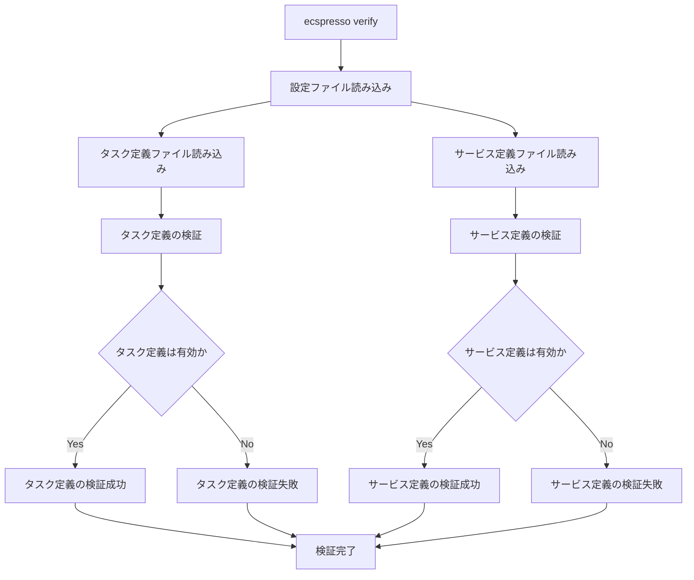

# verify

`verify`コマンドは、設定内のリソースを検証します。

## 基本的な使い方

```bash
ecspresso verify --config CONFIG_FILE
```

## オプション

| オプション | 説明 | デフォルト値 |
|------------|------|-------------|
| `--config` | 設定ファイルのパス | `ecspresso.yml` |
| `--task-definition` | タスク定義ファイルのパス | 設定ファイルで指定されたパス |
| `--service-definition` | サービス定義ファイルのパス | 設定ファイルで指定されたパス |
| `--secrets` | シークレットの存在を検証するかどうか | `true` |
| `--targets` | 検証するターゲット（task-definition, service-definition） | すべて |
| `--skip-task-definition` | タスク定義の検証をスキップするかどうか | `false` |
| `--skip-service-definition` | サービス定義の検証をスキップするかどうか | `false` |

## 詳細

`verify`コマンドは、以下の項目を検証します：

1. タスク定義
   - IAMロールの存在と権限
   - コンテナイメージの存在
   - シークレットの存在と読み取り権限
   - CloudWatchログの設定

2. サービス定義
   - ECSクラスターの存在
   - ターゲットグループの設定
   - セキュリティグループの設定
   - サブネットの設定

このコマンドは、デプロイ前に設定の問題を検出するのに役立ちます。

## 検証フロー



## 使用例

### 基本的な使用例

```bash
ecspresso verify --config ecspresso.yml
```

### タスク定義のみを検証する例

```bash
ecspresso verify --config ecspresso.yml --targets task-definition
```

### サービス定義のみを検証する例

```bash
ecspresso verify --config ecspresso.yml --targets service-definition
```

### シークレットの検証をスキップする例

```bash
ecspresso verify --config ecspresso.yml --secrets=false
```

### タスク定義の検証をスキップする例

```bash
ecspresso verify --config ecspresso.yml --skip-task-definition
```

### サービス定義の検証をスキップする例

```bash
ecspresso verify --config ecspresso.yml --skip-service-definition
```

## 検証項目

### タスク定義の検証項目

1. **IAMロール**
   - タスク実行ロールの存在
   - タスクロールの存在
   - 必要な権限の確認

2. **コンテナイメージ**
   - イメージの存在
   - イメージのタグの存在

3. **シークレット**
   - シークレットの存在
   - シークレットへのアクセス権限

4. **ログ設定**
   - CloudWatchロググループの存在
   - ログ設定の有効性

### サービス定義の検証項目

1. **ECSクラスター**
   - クラスターの存在

2. **ネットワーク設定**
   - サブネットの存在
   - セキュリティグループの存在
   - VPCの設定

3. **ロードバランサー設定**
   - ターゲットグループの存在
   - リスナーの設定

4. **Auto Scaling設定**
   - Auto Scalingポリシーの有効性

## エラーメッセージ

`verify`コマンドは、検証に失敗した場合に詳細なエラーメッセージを表示します。これにより、問題を特定して修正することができます。

エラーメッセージの例：
```
ERROR: IAM Role "arn:aws:iam::123456789012:role/ecsTaskExecutionRole" does not exist
ERROR: Container image "nginx:latest" does not exist in the repository
ERROR: Secret "arn:aws:secretsmanager:ap-northeast-1:123456789012:secret:my-secret" does not exist
ERROR: Target Group "arn:aws:elasticloadbalancing:ap-northeast-1:123456789012:targetgroup/my-target-group/1234567890123456" does not exist
```
