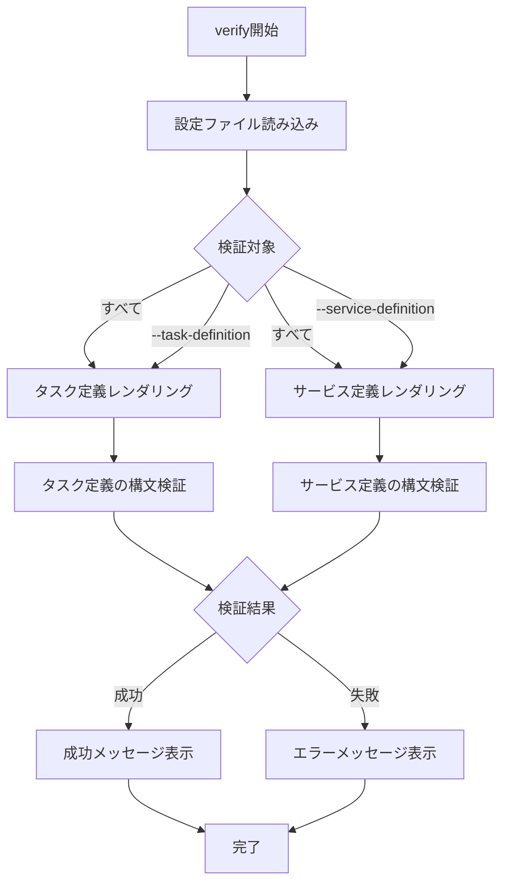

# verify

`verify`コマンドは、タスク定義とサービス定義の構文を検証します。デプロイ前に設定ファイルが正しいかどうかを確認するのに役立ちます。

## 基本的な使い方

```console
$ ecspresso verify --config ecspresso.yml
```

## オプション

| オプション | 説明 | デフォルト値 |
|------------|------|-------------|
| `--config FILE` | 設定ファイルのパス | `ecspresso.yml` |
| `--task-definition` | タスク定義のみを検証 | `false` |
| `--service-definition` | サービス定義のみを検証 | `false` |

## 使用例

### すべての定義ファイルを検証

```console
$ ecspresso verify --config ecspresso.yml
```

### タスク定義のみを検証

```console
$ ecspresso verify --config ecspresso.yml --task-definition
```

### サービス定義のみを検証

```console
$ ecspresso verify --config ecspresso.yml --service-definition
```

## 検証フロー

`verify`コマンドの実行フローは以下の通りです：



## 検証内容

`verify`コマンドは以下の検証を行います：

1. タスク定義の検証
   - 必須フィールドの存在確認
   - フィールドの型チェック
   - コンテナ定義の検証
   - ボリューム定義の検証
   - タスクロール、実行ロールの検証

2. サービス定義の検証
   - 必須フィールドの存在確認
   - フィールドの型チェック
   - ネットワーク設定の検証
   - ロードバランサー設定の検証
   - デプロイメント設定の検証

## 注意事項

- `verify`コマンドは実際のデプロイを行わず、設定ファイルの構文のみを検証します
- テンプレート変数や関数が正しく評価されない場合、エラーが表示されます
- 環境変数が見つからない場合、`env`関数は空文字列を返しますが、`must_env`関数はエラーを発生させます
- 検証に成功しても、AWSのサービス制限やIAM権限の問題でデプロイが失敗する可能性があります
