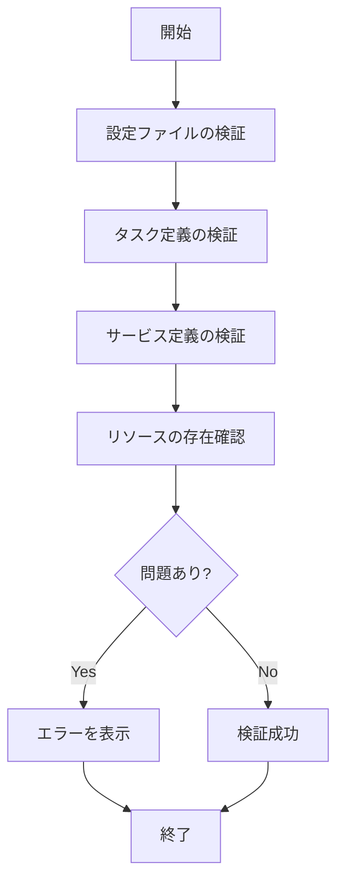

# verify

`verify`コマンドは、設定内のリソースを検証するために使用します。デプロイ前に設定の問題を検出するのに役立ちます。

## 構文

```
ecspresso verify [オプション]
```

## オプション

| オプション | 説明 | デフォルト値 |
|------------|------|-------------|
| `--save-task-definition` | 検証後にタスク定義を保存するファイルパス | `` |
| `--save-service-definition` | 検証後にサービス定義を保存するファイルパス | `` |
| `--skip-validation` | タスク定義の検証をスキップ | `false` |

## 使用例

### 基本的な使用方法

```bash
ecspresso verify
```

### 検証後にタスク定義を保存

```bash
ecspresso verify --save-task-definition verified-task-def.json
```

### 検証後にサービス定義を保存

```bash
ecspresso verify --save-service-definition verified-service-def.json
```

## 検証プロセス

`verify`コマンドは、以下の項目を検証します：

1. 設定ファイル（ecspresso.yml）の構文
2. タスク定義の構文と有効性
3. サービス定義の構文と有効性
4. 参照されているリソース（IAMロール、セキュリティグループなど）の存在



## 検証エラーの例

```
ERROR: task definition validation failed: InvalidParameterException: The container app does not have any essential containers
ERROR: service definition validation failed: InvalidParameterException: The security group 'sg-12345678' does not exist
```

## 注意事項

- `verify`コマンドは実際の変更を行わず、設定の検証のみを行います。
- デプロイ前に`verify`コマンドを実行して、設定の問題を事前に検出することをお勧めします。
- CI/CDパイプラインに`verify`コマンドを組み込むことで、問題のある設定がデプロイされるのを防ぐことができます。

## 関連コマンド

- [deploy](./deploy.html) - サービスをデプロイ
- [diff](./diff.html) - タスク定義、サービス定義と実行中のサービス間の差分を表示
- [render](./render.html) - 設定、サービス定義、またはタスク定義ファイルをSTDOUTに出力
