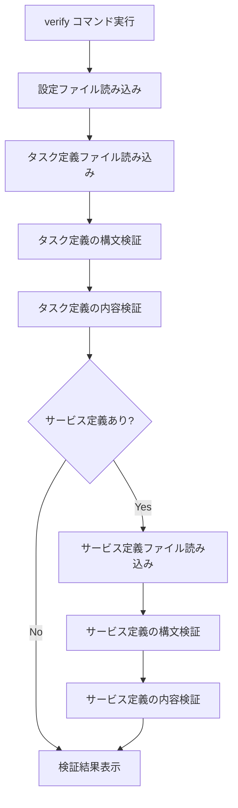

# verify

`verify`コマンドは、設定ファイル（タスク定義、サービス定義）の構文と内容を検証します。デプロイ前に設定ファイルの問題を検出するのに役立ちます。

## 基本的な使い方

```bash
ecspresso verify
```

## オプション

| オプション | 説明 | デフォルト値 |
|------------|------|------------|
| `--task-def` | 検証するタスク定義ファイル | 設定ファイルの`task_definition` |
| `--service-def` | 検証するサービス定義ファイル | 設定ファイルの`service_definition` |

## 検証内容

`verify`コマンドは以下の検証を行います：

1. **タスク定義の検証**
   - JSON/YAML構文の検証
   - 必須フィールドの存在確認
   - フィールド値の妥当性チェック
   - コンテナ定義の検証

2. **サービス定義の検証**（サービス定義ファイルが指定されている場合）
   - JSON/YAML構文の検証
   - 必須フィールドの存在確認
   - フィールド値の妥当性チェック
   - ネットワーク設定の検証

## 検証プロセス



## 検証結果

検証に成功した場合、以下のようなメッセージが表示されます：

```
Task definition: valid
Service definition: valid
```

問題が検出された場合は、エラーメッセージが表示されます：

```
Task definition: invalid
  - Missing required field: containerDefinitions
```

## 使用例

### 基本的な検証

```bash
ecspresso verify
```

### 特定のタスク定義ファイルを検証

```bash
ecspresso verify --task-def=custom-task-def.json
```

### 特定のサービス定義ファイルを検証

```bash
ecspresso verify --service-def=custom-service-def.json
```

## 注意事項

- `verify`コマンドは、AWS APIを呼び出さずにローカルで検証を行います。そのため、AWS側の制約（サービスクォータなど）に関する検証は行われません。
- タスク定義ファイルは必須ですが、サービス定義ファイルはオプションです。サービス定義ファイルが指定されていない場合、サービス定義の検証はスキップされます。
- Jsonnet形式のファイルを使用している場合、まず内部的にJSONに変換してから検証が行われます。
