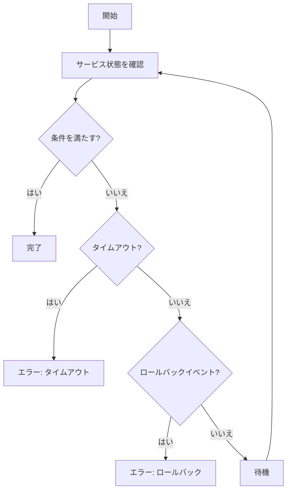

# wait

`wait`コマンドは、ECSサービスが安定状態（stable）になるまで待機するためのコマンドです。デプロイ後にサービスが完全に起動するまで待ちたい場合や、CI/CDパイプラインでデプロイの完了を確認したい場合に役立ちます。

## 基本的な使い方

```console
$ ecspresso wait [オプション]
```

## オプション

| オプション | 説明 | デフォルト値 |
|------------|------|------------|
| `--config` | 設定ファイルのパス | `ecspresso.yml` |
| `--timeout` | タイムアウト時間 | 設定ファイルの`timeout`値（デフォルト: 10分） |
| `--service-status` | 待機するサービスのステータス（`ACTIVE`、`DRAINING`、`INACTIVE`） | `ACTIVE` |
| `--deployment-status` | 待機するデプロイメントのステータス（`PRIMARY`、`ACTIVE`、`INACTIVE`） | `PRIMARY` |
| `--tasks-status` | 待機するタスクのステータス（`RUNNING`、`STOPPED`） | `RUNNING` |
| `--tasks-desired-count` | 待機する希望タスク数 | サービス定義の`desiredCount` |
| `--tasks-running-count` | 待機する実行中タスク数 | サービス定義の`desiredCount` |
| `--rollback-events` | ロールバックを引き起こすイベントパターン | - |

## 出力例

```
2023/01/01 12:00:00 [info] myservice/default Waiting for service stable...(it will take a few minutes)
2023/01/01 12:00:10 [info] myservice/default  PRIMARY myservice:3 desired:2 pending:1 running:1
2023/01/01 12:00:20 [info] myservice/default  PRIMARY myservice:3 desired:2 pending:0 running:2
2023/01/01 12:00:30 [info] myservice/default Service is stable now. Completed!
```

## 使用例

### 基本的な使用方法

```console
$ ecspresso wait --config ecspresso.yml
```

### タイムアウト時間を指定

```console
$ ecspresso wait --config ecspresso.yml --timeout 5m
```

### 特定のサービスステータスを待機

```console
$ ecspresso wait --config ecspresso.yml --service-status ACTIVE
```

### 特定のデプロイメントステータスを待機

```console
$ ecspresso wait --config ecspresso.yml --deployment-status PRIMARY
```

### 特定のタスクステータスを待機

```console
$ ecspresso wait --config ecspresso.yml --tasks-status RUNNING
```

### 特定の希望タスク数を待機

```console
$ ecspresso wait --config ecspresso.yml --tasks-desired-count 3
```

### 特定の実行中タスク数を待機

```console
$ ecspresso wait --config ecspresso.yml --tasks-running-count 3
```

### ロールバックイベントを指定

```console
$ ecspresso wait --config ecspresso.yml --rollback-events "DEPLOYMENT_FAILURE"
```

## 待機プロセス

`wait`コマンドは、以下のプロセスでサービスの状態を監視します：

1. 指定された間隔（デフォルト: 10秒）でサービスの状態を確認
2. 指定された条件（サービスステータス、デプロイメントステータス、タスクステータス、タスク数）を満たすまで待機
3. タイムアウト時間を超えた場合はエラーで終了
4. ロールバックイベントが発生した場合はエラーで終了



## サービスの安定状態

サービスが「安定状態」と見なされるための条件：

1. サービスのステータスが指定された値（デフォルト: `ACTIVE`）である
2. デプロイメントのステータスが指定された値（デフォルト: `PRIMARY`）である
3. タスクのステータスが指定された値（デフォルト: `RUNNING`）である
4. 実行中のタスク数が希望タスク数と一致する
5. 保留中のタスク数が0である

## ロールバックイベント

`--rollback-events`オプションを使用すると、特定のイベントが発生した場合に自動的にエラーで終了し、CI/CDパイプラインでのロールバックを引き起こすことができます。

主なロールバックイベントの例：

- `DEPLOYMENT_FAILURE`: デプロイメントの失敗
- `SERVICE_UPDATE_FAILURE`: サービス更新の失敗
- `HEALTH_CHECK_FAILURE`: ヘルスチェックの失敗
- `CAPACITY_PROVIDER_FAILURE`: キャパシティプロバイダーの失敗

複数のイベントを指定する場合はカンマで区切ります：

```console
$ ecspresso wait --config ecspresso.yml --rollback-events "DEPLOYMENT_FAILURE,HEALTH_CHECK_FAILURE"
```

## CI/CDパイプラインでの使用

`wait`コマンドは、CI/CDパイプラインでデプロイの完了を確認するのに役立ちます。以下は、GitHub Actionsでの使用例です：

```yaml
jobs:
  deploy:
    runs-on: ubuntu-latest
    steps:
      - uses: actions/checkout@v3
      - uses: kayac/ecspresso@v2
        with:
          version: v2.3.0
      - run: |
          ecspresso deploy --config ecspresso.yml
          ecspresso wait --config ecspresso.yml --timeout 10m --rollback-events "DEPLOYMENT_FAILURE"
```

## 注意事項

- `wait`コマンドは、AWSリソースとの通信を行うため、AWS認証情報が正しく設定されている必要があります
- タイムアウト時間は、デプロイの規模や環境に応じて適切に設定してください
- CI/CDパイプラインでは、`--rollback-events`オプションを使用して自動的にロールバックを引き起こすことをお勧めします
- `wait`コマンドは、`deploy`コマンドの後に実行することが一般的です
- `deploy`コマンドには`--no-wait`オプションがあり、このオプションを指定すると`deploy`コマンドはサービスの安定状態を待たずに終了します。その場合は、別途`wait`コマンドを実行する必要があります

## 関連コマンド

- [deploy](./deploy.html) - サービスをデプロイ
- [status](./status.html) - サービスの状態を表示
- [exec](./exec.html) - タスク内でコマンドを実行
- [run](./run.html) - 一時的なタスクを実行
