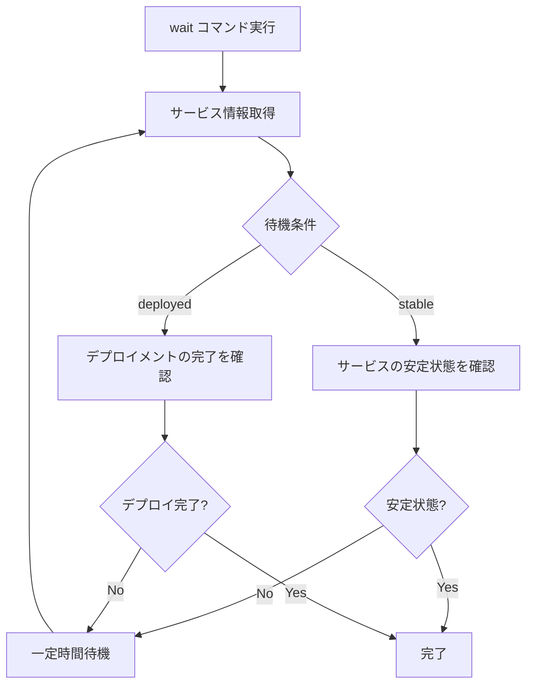

# wait

`wait`コマンドは、ECSサービスが安定状態になるまで、またはデプロイメントが完了するまで待機します。CI/CDパイプラインでデプロイの完了を確認する際に特に役立ちます。

## 基本的な使い方

```bash
ecspresso wait
```

## オプション

| オプション | 説明 | デフォルト値 |
|------------|------|------------|
| `--timeout` | タイムアウト時間 | 設定ファイルの`timeout`値 |
| `--until` | 待機条件（stable/deployed） | `stable` |

## 待機条件

`--until`オプションで指定できる待機条件は以下の2種類です：

1. **stable** - サービスが安定状態になるまで待機します。これは、希望するタスク数が実行中になり、古いタスクが停止した状態を意味します。
2. **deployed** - デプロイメントが完了するまで待機します。これは、新しいデプロイメントが作成され、プライマリデプロイメントになった状態を意味します。

デフォルトは`stable`です。

## 待機プロセス



## タイムアウト

`--timeout`オプションで待機のタイムアウト時間を指定できます。タイムアウトした場合、コマンドはエラーで終了します。

```bash
# 5分のタイムアウトを設定
ecspresso wait --timeout=5m
```

タイムアウト時間は、以下の形式で指定できます：
- `10s` - 10秒
- `5m` - 5分
- `2h` - 2時間

## 使用例

### 基本的な使用方法

```bash
ecspresso wait
```

### デプロイメントの完了まで待機

```bash
ecspresso wait --until=deployed
```

### カスタムタイムアウトで待機

```bash
ecspresso wait --timeout=10m
```

### デプロイ後に待機

`deploy`コマンドの`--no-wait`オプションと組み合わせて使用することで、デプロイ後に別のコマンドを実行してから待機することができます：

```bash
# デプロイ後に待機しない
ecspresso deploy --no-wait

# 何か別の処理を実行
# ...

# その後、サービスが安定するまで待機
ecspresso wait
```

## CI/CDパイプラインでの使用例

CI/CDパイプラインでは、以下のようなフローでecspressoを使用することができます：

```bash
# デプロイ実行（待機なし）
ecspresso deploy --no-wait

# デプロイの完了を待機
ecspresso wait --until=deployed

# サービスの安定を待機
ecspresso wait --until=stable

# デプロイ後のテストを実行
# ...
```

## 注意事項

- サービスが存在しない場合は、エラーが発生します。
- タイムアウトした場合、コマンドはエラーで終了します。
- CodeDeployを使用している場合、`--until=deployed`オプションはCodeDeployのデプロイメントの完了を待機します。
