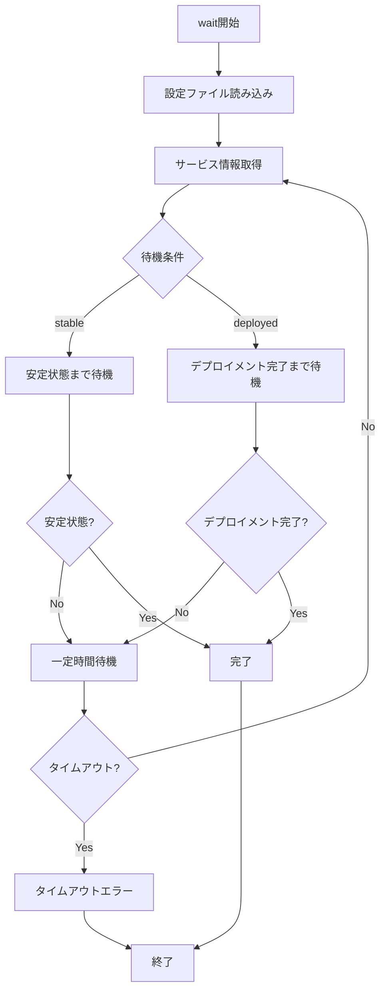

# wait

`wait`コマンドは、ECSサービスが安定状態になるまで待機します。デプロイ後にサービスが完全に起動するまで待ちたい場合に便利です。

## 基本的な使い方

```console
$ ecspresso wait --config ecspresso.yml
```

## オプション

| オプション | 説明 | デフォルト値 |
|------------|------|-------------|
| `--config FILE` | 設定ファイルのパス | `ecspresso.yml` |
| `--timeout DURATION` | タイムアウト時間 | 設定ファイルの`timeout`値（デフォルト: `10m`） |
| `--wait-until` | 待機条件（`stable`または`deployed`） | `stable` |

## 使用例

### 基本的な待機

```console
$ ecspresso wait --config ecspresso.yml
```

### タイムアウト時間を指定して待機

```console
$ ecspresso wait --config ecspresso.yml --timeout 5m
```

### デプロイメント完了まで待機

```console
$ ecspresso wait --config ecspresso.yml --wait-until deployed
```

## 待機条件

`wait`コマンドは、以下の条件のいずれかが満たされるまで待機します：

1. `--wait-until stable`（デフォルト）
   - サービスのプライマリデプロイメントが安定状態になる
   - 希望するタスク数と実行中のタスク数が一致する
   - すべてのタスクが最新のタスク定義で実行されている

2. `--wait-until deployed`
   - デプロイメントが完了する（サービスが完全に安定していなくても）
   - プライマリデプロイメントのデプロイメント状態が`COMPLETED`になる

## 待機フロー

`wait`コマンドの実行フローは以下の通りです：



## 注意事項

- サービスが存在しない場合、エラーが表示されます
- タイムアウト時間を超えても条件が満たされない場合、エラーが表示されます
- `--wait-until deployed`オプションは、CodeDeployを使用したBlue/Greenデプロイメントの場合に特に有用です
- `wait`コマンドは、`deploy`コマンドの`--wait`オプションと同じ機能を提供しますが、別のコマンドとして実行できます
