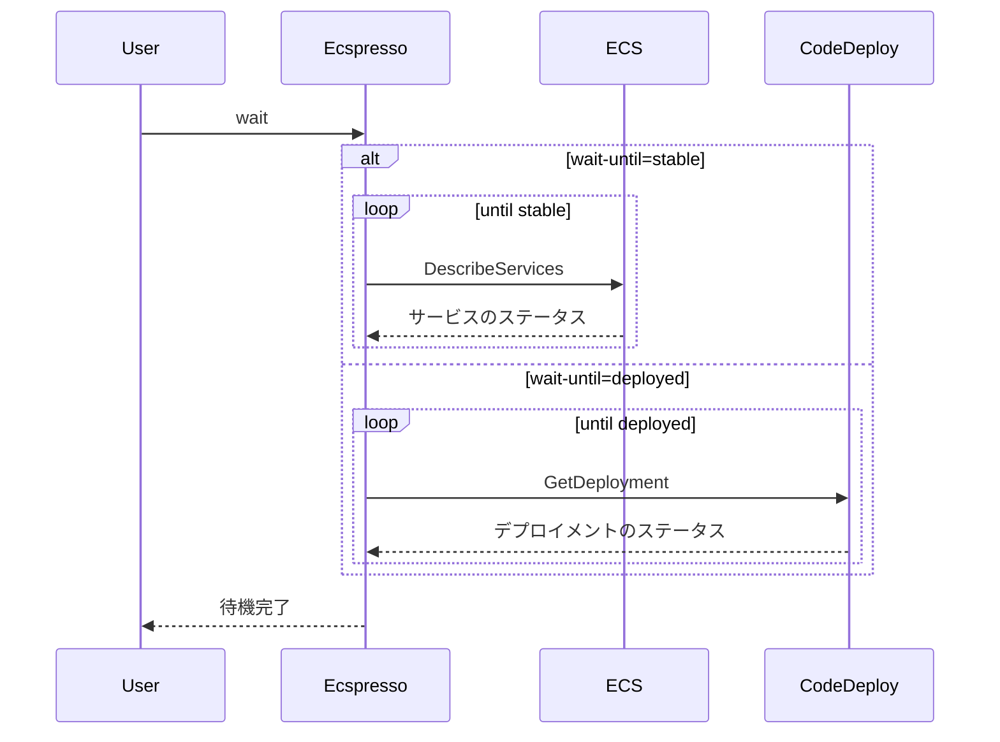

# wait

`wait`コマンドは、ECSサービスが安定するまで待機するために使用します。

## 構文

```
ecspresso wait [オプション]
```

## オプション

| オプション | 説明 | デフォルト値 |
|------------|------|-------------|
| `--timeout` | タイムアウト時間（秒） | （設定ファイルの値） |
| `--wait-until` | どの状態まで待機するか（stable/deployed） | `stable` |

## 使用例

### 基本的な使用方法

```bash
ecspresso wait
```

### タイムアウトを指定

```bash
ecspresso wait --timeout 300
```

### デプロイ完了まで待機

```bash
ecspresso wait --wait-until deployed
```

## 待機プロセス

`wait`コマンドは、サービスが指定された状態（デフォルトでは「stable」）に達するまで待機します。

- `stable`: プライマリデプロイメントが希望タスク数に達し、すべてのタスクが正常に実行されている状態
- `deployed`: CodeDeployを使用したBlue/Greenデプロイメントが完了した状態



## ユースケース

- デプロイ後にサービスが安定するまで待機
- CI/CDパイプラインでの自動デプロイ後の検証
- スクリプト内でのデプロイ完了の確認

## 注意事項

- `--timeout`オプションを使用して、最大待機時間を指定できます。タイムアウトに達すると、コマンドはエラーで終了します。
- CodeDeployを使用したBlue/Greenデプロイメントの場合は、`--wait-until deployed`を使用することをお勧めします。

## 関連コマンド

- [deploy](./deploy.html) - サービスをデプロイ
- [status](./status.html) - サービスの状態を表示
