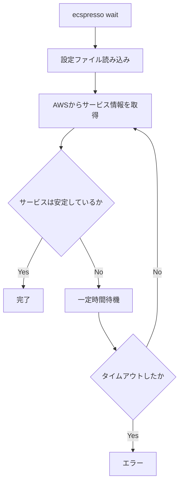

# wait

`wait`コマンドは、サービスが安定するまで待機します。

## 基本的な使い方

```bash
ecspresso wait --config CONFIG_FILE
```

## オプション

| オプション | 説明 | デフォルト値 |
|------------|------|-------------|
| `--config` | 設定ファイルのパス | `ecspresso.yml` |
| `--timeout` | タイムアウト時間 | 設定ファイルで指定されたタイムアウト |
| `--service` | サービス名 | 設定ファイルで指定されたサービス |
| `--cluster` | ECSクラスター名 | 設定ファイルで指定されたクラスター |
| `--suspend-auto-scaling` | Auto Scalingを一時停止するかどうか | `false` |
| `--resume-auto-scaling` | Auto Scalingを再開するかどうか | `false` |

## 詳細

`wait`コマンドは、以下の処理を行います：

1. 指定されたサービスのステータスを定期的に確認
2. サービスが安定状態（STEADY_STATE）になるまで待機
3. タイムアウト時間を超えた場合はエラーを返す

このコマンドは、デプロイ後にサービスが安定するまで待機するのに役立ちます。

## 待機フロー



## 使用例

### 基本的な使用例

```bash
ecspresso wait --config ecspresso.yml
```

### タイムアウトを指定する例

```bash
ecspresso wait --config ecspresso.yml --timeout 5m
```

### 特定のサービスを指定する例

```bash
ecspresso wait --config ecspresso.yml --service myservice
```

### 特定のクラスターを指定する例

```bash
ecspresso wait --config ecspresso.yml --cluster mycluster
```

### Auto Scalingを一時停止する例

```bash
ecspresso wait --config ecspresso.yml --suspend-auto-scaling
```

### Auto Scalingを再開する例

```bash
ecspresso wait --config ecspresso.yml --resume-auto-scaling
```

## サービスの安定状態

ECSサービスの安定状態とは、以下の条件を満たす状態です：

1. デプロイメントが完了している
2. 実行中のタスク数が希望するタスク数と一致している
3. 保留中のタスクがない
4. すべてのタスクが最新のタスク定義を使用している

サービスが安定状態になるまでの時間は、以下の要因によって異なります：

1. タスクの起動時間
2. コンテナのヘルスチェック
3. デプロイメント設定（最小ヘルスパーセント、最大パーセント）
4. サービスの規模（タスク数）

## タイムアウト

`wait`コマンドは、指定されたタイムアウト時間内にサービスが安定状態にならない場合、エラーを返します。タイムアウト時間は、`--timeout`オプションまたは設定ファイルで指定できます。

設定ファイルでのタイムアウト指定例：
```yaml
region: ap-northeast-1
cluster: default
service: myservice
task_definition: ecs-task-def.json
service_definition: ecs-service-def.json
timeout: 10m
```

## Auto Scaling

`wait`コマンドは、Auto Scalingを一時停止または再開するオプションを提供しています。これは、デプロイ中にAuto Scalingによるタスク数の変更を防ぐのに役立ちます。

- `--suspend-auto-scaling` - Auto Scalingを一時停止します
- `--resume-auto-scaling` - Auto Scalingを再開します
