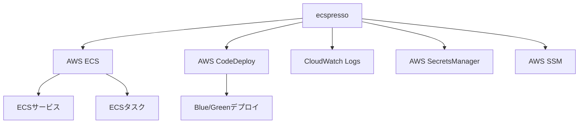

# ecspresso ドキュメント

Amazon ECS向けのデプロイツール「ecspresso」の公式ドキュメントへようこそ。

ecspressoは、Amazon ECSサービスとタスクを簡単に管理するためのツールです。コード化されたタスク定義とサービス定義を使用して、ECSリソースをデプロイ、更新、監視することができます。

## 主な機能

- **シンプルなデプロイ**: 既存のECSサービスを簡単に更新
- **テンプレート機能**: 環境変数を使用して設定をカスタマイズ
- **Blue/Greenデプロイ**: AWS CodeDeployを使用した無停止デプロイ
- **タスク管理**: ワンタイムタスクの実行とログ監視
- **リソース検証**: サービス設定の検証とトラブルシューティング
- **Jsonnetサポート**: 高度な設定管理

## アーキテクチャ図

詳細については、各セクションを参照してください。
