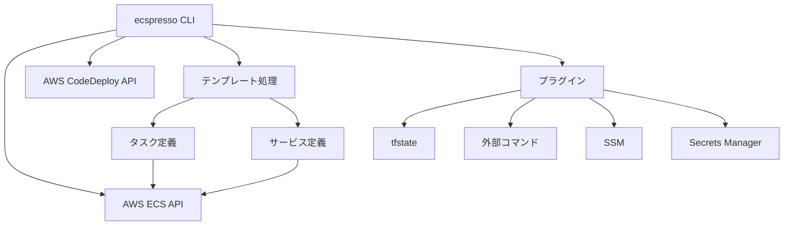

# ecspressoとは

ecspressoは、Amazon ECS（Elastic Container Service）向けのデプロイツールです。コマンドラインから簡単にECSサービスの管理ができます。

## 主な機能

- ECSサービスのデプロイと管理
- タスク定義の登録と更新
- Blue/Greenデプロイ（AWS CodeDeployとの連携）
- ECSタスクの実行と管理
- 複数環境での設定管理
- サービスとタスク定義の差分確認
- タスク上でのコマンド実行（exec）

## アーキテクチャ

## サポートする機能

ecspressoは以下のAWS ECS機能をサポートしています：

- Fargate
- Fargate Spot
- Service Connect
- EBS Volumes
- VPC Lattice

## テンプレート機能

ecspressoはタスク定義とサービス定義のテンプレート処理をサポートしています：

- Go テンプレート構文
- 環境変数の参照
- Jsonnet
