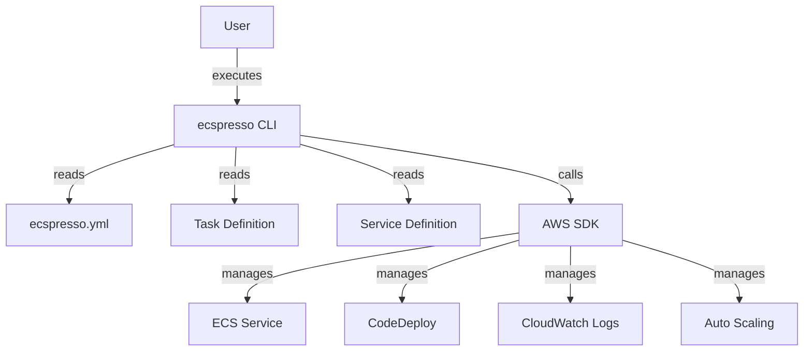

# About ecspresso

ecspresso is a deployment tool for Amazon ECS (Elastic Container Service). It simplifies the management of ECS services and tasks through a simple command-line interface.

## Key Features

- **Infrastructure as Code**: Manage your ECS deployments using JSON definition files
- **Blue/Green Deployment**: Zero-downtime deployments with AWS CodeDeploy integration
- **Dry Run Mode**: Preview changes before applying them
- **Rollback Support**: Easily roll back to previous deployments
- **Task Management**: Run one-off tasks and execute commands inside containers
- **Advanced Templating**: Support for Jsonnet and template functions
- **Diff Comparisons**: Compare local and remote configurations
- **CloudWatch Integration**: View container logs directly
- **Auto Scaling Management**: Control application auto-scaling settings

## Architecture Overview

ecspresso serves as a wrapper around the AWS SDK, providing a more user-friendly interface for managing ECS resources. It uses local configuration and definition files to specify the desired state of your services and task definitions.
