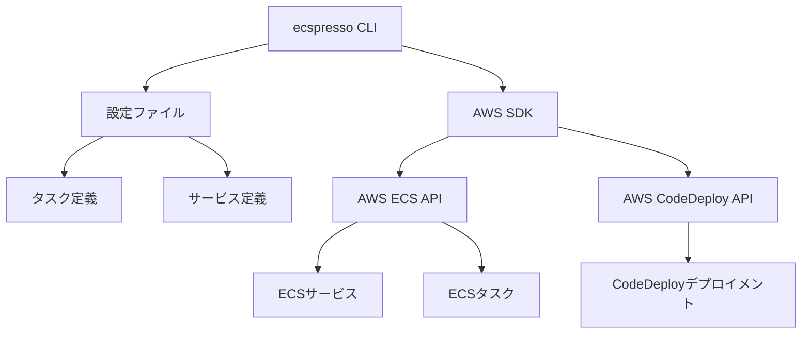

# ecspressoとは

ecspressoは、AWS Elastic Container Service (ECS) のデプロイと管理を簡素化するためのコマンドラインツールです。Go言語で実装されており、AWSのECSサービスとタスク定義を効率的に管理することができます。

## 主な特徴

ecspressoは以下のような特徴を持っています：

- **宣言的な設定**: JSONやYAML形式の設定ファイルを使用して、ECSサービスとタスク定義を宣言的に管理できます
- **差分デプロイ**: 現在のECS設定と新しい設定の差分を確認してから、必要な変更のみを適用できます
- **ローカル開発との統合**: ローカル環境で設定を検証してから、本番環境にデプロイできます
- **Blue/Greenデプロイメント**: AWS CodeDeployと統合して、ゼロダウンタイムデプロイメントを実現できます
- **複数環境対応**: 開発、ステージング、本番など、複数の環境で同じ設定ファイルを使い分けることができます
- **テンプレート機能**: 環境変数や外部コマンドの出力を設定ファイルに埋め込むことができます

## ユースケース

ecspressoは以下のようなユースケースに適しています：

- コンテナ化されたアプリケーションのECSへのデプロイ
- CI/CDパイプラインでの自動デプロイ
- 複数環境（開発、ステージング、本番）での一貫したデプロイ
- Blue/Greenデプロイメントによるゼロダウンタイムリリース
- ECSサービスの状態監視と管理

## アーキテクチャ

ecspressoは以下のようなアーキテクチャで動作します：

ecspressoはAWS SDKを使用してECS APIとCodeDeploy APIと通信し、ECSサービスとタスクを管理します。設定ファイルはローカルで管理され、ecspressoコマンドを実行する際に使用されます。
