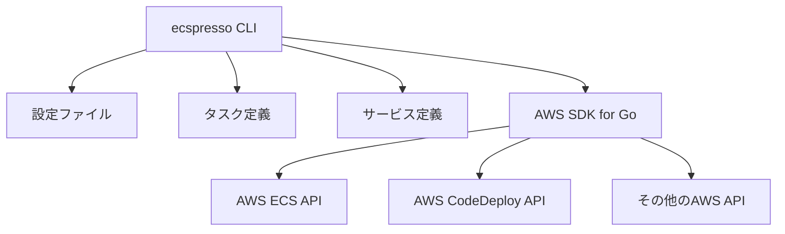
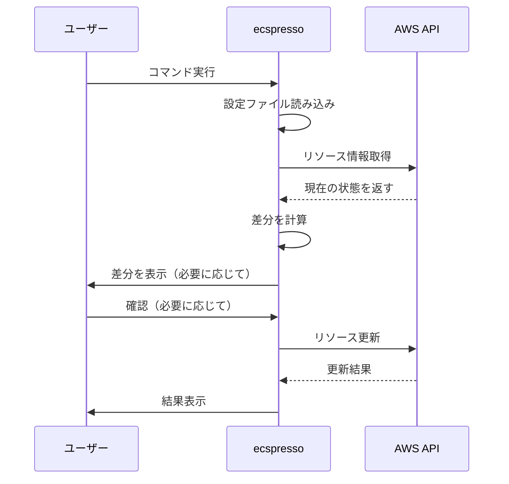

# ecspressoとは

ecspressoは、AWS Elastic Container Service (ECS)のリソース管理を簡素化するためのコマンドラインツールです。Goで開発されており、ECSサービスのデプロイ、タスク定義の管理、サービスの状態監視など、様々な操作を効率的に行うことができます。

## 主な機能

- ECSサービスのデプロイと管理
- タスク定義の登録と管理
- サービスの状態確認とモニタリング
- AWS CodeDeployを使用したブルー/グリーンデプロイメント
- 一時的なタスクの実行
- 複数環境（開発、ステージング、本番）での設定管理

## アーキテクチャ

ecspressoは、AWS SDK for Goを使用してAWS ECS APIと通信します。設定ファイルとして`ecspresso.yml`を使用し、タスク定義とサービス定義をJSON形式で管理します。

## データフロー

ecspressoを使用したデプロイメントのデータフローは次のようになります：

