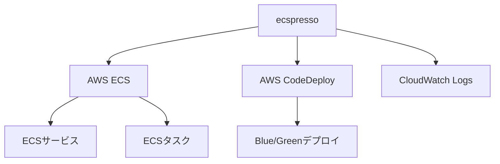
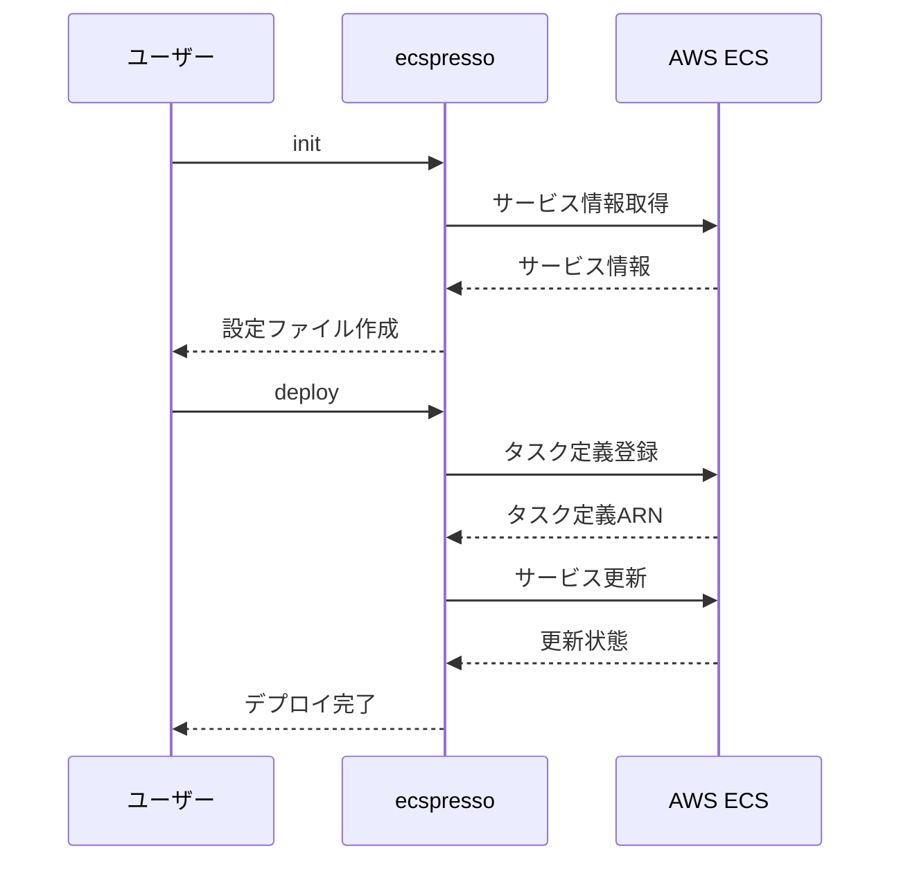

# ecspressoとは

ecspressoは、Amazon ECS（Elastic Container Service）のためのデプロイツールです。コード化されたタスク定義とサービス定義を使用して、ECSリソースをデプロイ、更新、監視することができます。

## 主な機能

- **シンプルなデプロイ**: 既存のECSサービスを簡単に更新
- **テンプレート機能**: 環境変数を使用して設定をカスタマイズ
- **Blue/Greenデプロイ**: AWS CodeDeployを使用した無停止デプロイ
- **タスク管理**: ワンタイムタスクの実行とログ監視
- **リソース検証**: サービス設定の検証とトラブルシューティング
- **Jsonnetサポート**: 高度な設定管理

## アーキテクチャ

## ワークフロー

ecspressoの基本的なワークフローは以下の通りです：

1. **初期化**: 既存のECSサービスから設定ファイルを作成
2. **設定**: タスク定義とサービス定義をカスタマイズ
3. **デプロイ**: 新しいタスク定義を登録し、サービスを更新
4. **監視**: サービスの状態を確認し、ログを監視

