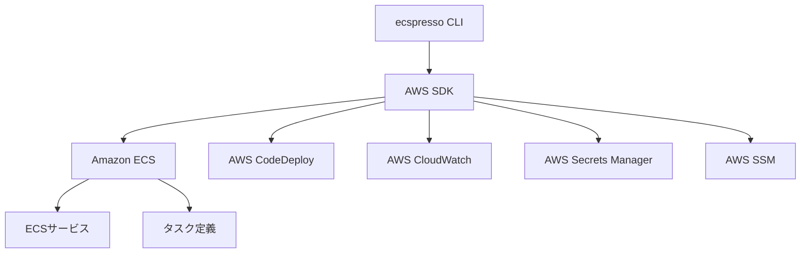

# ecspressoとは

ecspressoは、Amazon ECS（Elastic Container Service）向けのデプロイツールです。コマンドラインから簡単にECSサービスとタスク定義を管理することができます。

## 主な機能

- ECSサービスのデプロイ管理
- タスク定義の登録と管理
- Blue/Greenデプロイのサポート（AWS CodeDeployと連携）
- ロールバック機能
- タスクの実行と管理
- テンプレート機能による環境変数の置換
- Jsonnetサポートによる柔軟な設定
- 外部プラグインのサポート
- AWS Secrets ManagerとSSMパラメータストアの統合
- ECS Service Connectのサポート

## アーキテクチャ概要

## ecspressoが解決する課題

Amazon ECSでのデプロイは、タスク定義の登録、サービスの更新、デプロイの監視など、複数のステップが必要です。ecspressoはこれらのステップを自動化し、一貫性のあるデプロイプロセスを提供します。

### 従来のECSデプロイの課題

- 複数のAWS CLIコマンドを実行する必要がある
- タスク定義のJSONファイルを手動で管理する必要がある
- 環境ごとに異なる設定を管理するのが難しい
- デプロイの進行状況を監視するのが難しい

### ecspressoによる解決策

- 単一のコマンドでデプロイプロセス全体を自動化
- タスク定義とサービス定義をコードとして管理
- テンプレート機能による環境変数の置換
- デプロイの進行状況をリアルタイムで監視
- Jsonnetによる柔軟な設定管理

## ecspressoの特徴

### シンプルな設定

ecspressoは、YAML、JSON、またはJsonnet形式の設定ファイルを使用します。Jsonnet形式のサポートにより、より柔軟で再利用可能な設定が可能になりました。

### 柔軟なデプロイオプション

- ローリングデプロイ（ECSのデフォルト）
- Blue/Greenデプロイ（AWS CodeDeployと連携）
- タスク定義の更新のみ
- サービス設定の更新のみ
- 強制的な新しいデプロイメント
- デプロイ完了待機オプション（`--wait-until`）

### 豊富なコマンド

ecspressoは、デプロイだけでなく、タスクの実行、サービスの状態確認、タスク定義の差分表示など、多くのコマンドを提供しています。

## v1とv2の違い

ecspresso v2では、いくつかの破壊的変更と機能強化が行われています。主な変更点は以下の通りです：

### 破壊的変更

- `create`コマンドの廃止（`deploy`コマンドでサービスを作成可能）
- `rollback --deregister-task-definition`がデフォルトでtrue
- `render`コマンドがフラグではなく引数を受け付ける
- `verify`コマンドがIAMロールをexecutionRoleにロールバックしない
- `diff --unified`がデフォルトでtrue
- ログメッセージの出力形式の変更
- 設定ファイルの`filter_command`が非推奨（環境変数`ECSPRESSO_FILTER_COMMAND`を使用）
- CodeDeployを使用する場合、`deploy`コマンドはデプロイメントの完了を待つ（v1では開始時に終了）

### 機能強化

- 設定ファイルでCodeDeployのアプリケーション名とデプロイメントグループ名を指定可能
- 設定ファイルがJsonnet形式をサポート
- `render`コマンドが`--jsonnet`フラグをサポート
- CodeDeployでのデプロイ中にプログレスバーを表示
- `verify`コマンドがコンテナイメージプラットフォームを検証
- 複数のtfstateサポート（プレフィックスを使用）
- SSMパラメータストアプラグインの追加
- ECS Service Connectのサポート
- 外部プラグインのサポート
- JSONフォーマットのAppSpecサポート
- カラー出力の無効化オプション
- 外部diffコマンドのサポート
- 設定ファイルでの無視タグの指定
