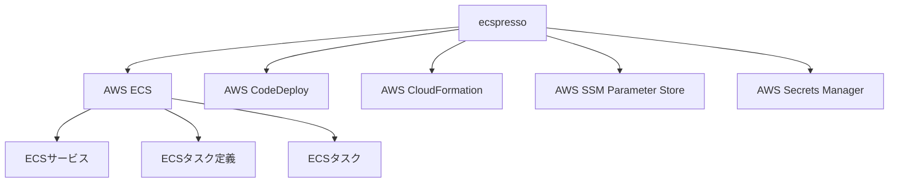

# ecspressoについて

ecspressoは、AWS Elastic Container Service (ECS)のデプロイと管理を簡単にするためのツールです。AWSのCLIやコンソールよりも簡潔なコマンドで、ECSのサービスやタスク定義を扱うことができます。

## 主な機能

- ECSサービスのデプロイ（ローリングデプロイとBlue/Greenデプロイをサポート）
- タスク定義の登録と管理
- 一時的なタスクの実行
- サービスの状態確認
- 設定ファイルの検証と表示

## アーキテクチャ概要

ecspressoはAWS SDKを使用して、ECSおよび関連するAWSサービスと通信します。設定ファイル（ecspresso.yml）と定義ファイル（ecs-task-def.json、ecs-service-def.json）を使用して、ECSリソースを管理します。
