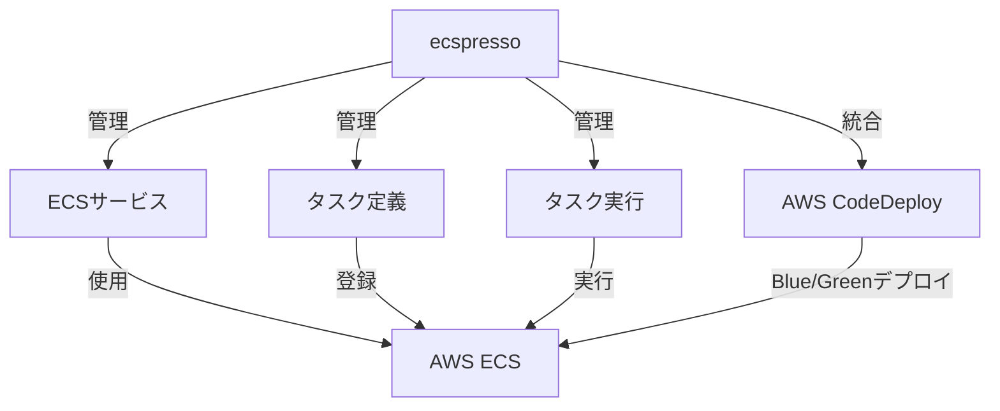
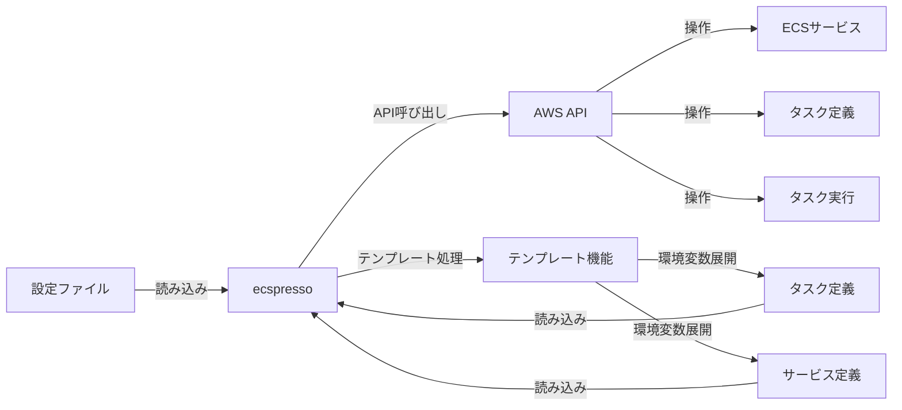

# ecspressoとは

ecspresso（エスプレッソと発音）は、Amazon ECS（Elastic Container Service）のためのデプロイツールです。AWS ECSリソースを簡単に管理するための機能を提供します。

## 概要

ecspressoは、AWSのECSサービスとタスク定義を管理するためのコマンドラインツールです。Infrastructure as Codeの原則に従い、ECSリソースの定義をJSONやJSONnetファイルとして管理し、それらを使用してAWS ECSリソースをデプロイ・管理します。

## 主な機能

ecspressoは以下の主な機能を提供します：

1. **ECSサービスとタスク定義の管理**
   - 既存のECSサービスからの設定ファイル生成
   - サービスのデプロイと更新
   - タスク定義の登録と管理

2. **デプロイ機能**
   - 通常のデプロイ
   - Blue/Greenデプロイ（AWS CodeDeployとの統合）
   - ロールバック機能

3. **タスク管理**
   - タスクの実行
   - タスク上でのコマンド実行
   - タスクのステータス確認

4. **設定管理**
   - テンプレート機能によるパラメータ化
   - 環境変数の利用
   - 複数環境での設定管理

5. **検証と差分確認**
   - リソースの検証
   - 設定の差分確認

## アーキテクチャ

ecspressoは以下のコンポーネントで構成されています：

## ユースケース

ecspressoは以下のようなユースケースに適しています：

1. **CI/CDパイプラインでのECSデプロイ自動化**
   - GitHubアクション、CircleCI、Jenkins等との統合

2. **複数環境（開発、ステージング、本番）でのECS管理**
   - 環境ごとの設定を環境変数で切り替え

3. **マイクロサービスアーキテクチャの管理**
   - 多数のECSサービスの一貫した管理

4. **Blue/Greenデプロイによる無停止更新**
   - AWS CodeDeployとの統合によるゼロダウンタイムデプロイ

5. **一時的なタスク実行**
   - メンテナンスやバッチ処理のためのタスク実行
