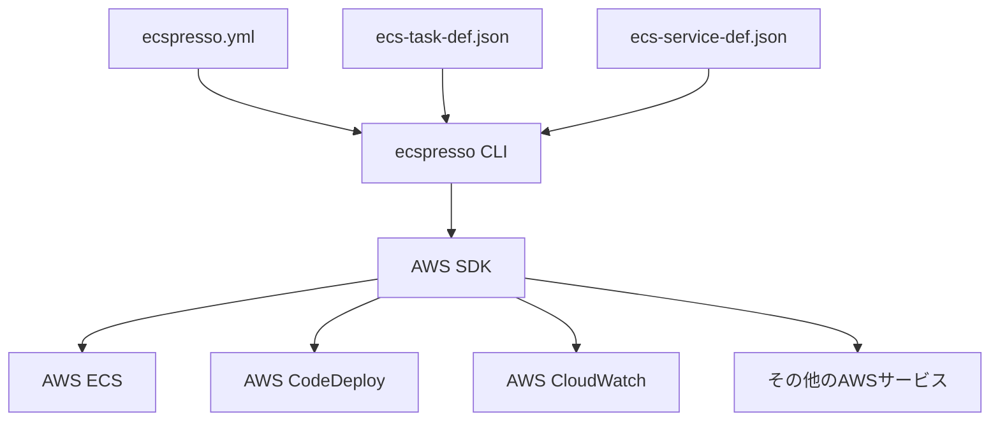

# ecspressoとは

ecspressoは、AWS Elastic Container Service (ECS)のデプロイと管理を簡素化するためのコマンドラインツールです。インフラストラクチャ・アズ・コードの原則に従って、ECSリソースを効率的に管理することができます。

## 主な機能

- **ECSサービスのデプロイ**: タスク定義とサービス定義を使用したデプロイ
- **ブルー/グリーンデプロイメント**: AWS CodeDeployとの統合による無停止デプロイ
- **タスク実行**: メンテナンスや管理目的のための一時的なタスク実行
- **サービス管理**: サービスの状態確認、スケーリング、ロールバックなど
- **設定検証**: デプロイ前の設定ファイルの検証
- **複数環境対応**: 開発、ステージング、本番環境など複数環境での設定管理

## アーキテクチャ概要

ecspressoは、設定ファイル（`ecspresso.yml`）とタスク定義ファイル（`ecs-task-def.json`）、サービス定義ファイル（`ecs-service-def.json`）を使用して、AWS ECSリソースを管理します。

## 使用シナリオ

ecspressoは以下のようなシナリオで特に役立ちます：

1. **CI/CDパイプラインの自動化**: コンテナイメージの更新とデプロイの自動化
2. **複数環境の管理**: 開発、テスト、本番環境など複数環境での一貫したデプロイ
3. **大規模サービスの管理**: マイクロサービスアーキテクチャにおける複数サービスの管理
4. **運用タスクの実行**: バッチ処理やメンテナンスタスクの実行

## ecspressoの利点

- **シンプルなコマンドライン操作**: 複雑なAWS ECSの操作をシンプルなコマンドで実行
- **設定ファイルによる管理**: インフラストラクチャ・アズ・コードの原則に基づいた管理
- **デプロイの安全性**: ロールバック機能やブルー/グリーンデプロイメントによる安全なデプロイ
- **柔軟な設定**: Jsonnetによるテンプレート機能のサポート
